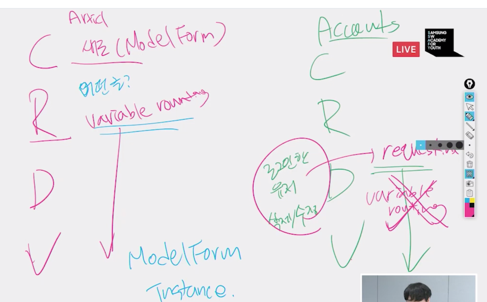

### user회원관리

- 게시글처럼 저장할 수 없다 -> 비밀번호는 암호화되어서 저장되어야하기 때문에

- User objects: superusers

  - 기본적 attribute

  - username/password/email/first_name/last_name

    

- HTTP 프로토콜의 특징

  - stateless(상태없음)
  - Connectless(연결없음)

- AbstractBaseUser: password, last_login, is_active

- 메서드 get_user_model

- ArticleForm => Article(모델)

- UserCreationForm=> User(모델)

- But, AuthenticationForm(로그인!!) => Form

  > ModelForm이 아니기 때문에(특정 모델과 연결되어 있지 않기 때문에) request와 request.POST를 같이 넘겨줘야 한다.

- signup.html

  - if request.user.is_authenticated:

- Base.html

  - if user.is_authenticated

- AnonymousUser

- @login_required

  - LOGIN_URL = '/accounts/login/'.  #default값

- Update 

  > from django.contrib.auth.forms import UserChangeForm(forms.py)

- 1. Form 제공: GET
  2. 데이터 양식=> 처리: POST

