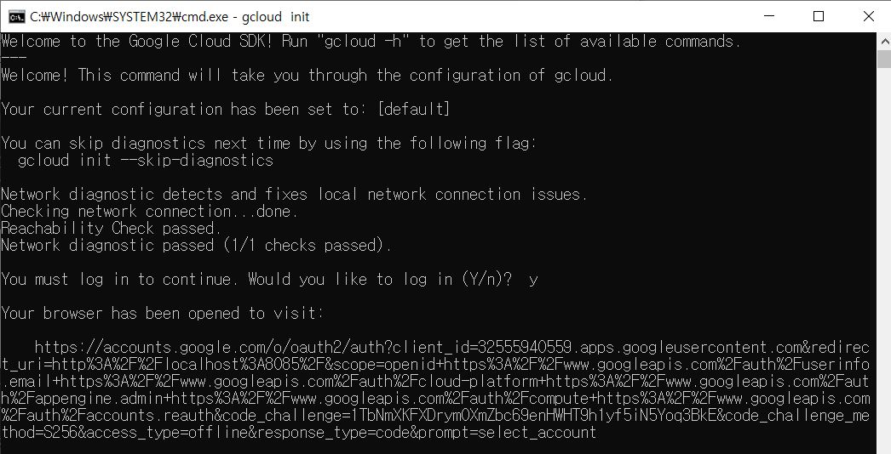
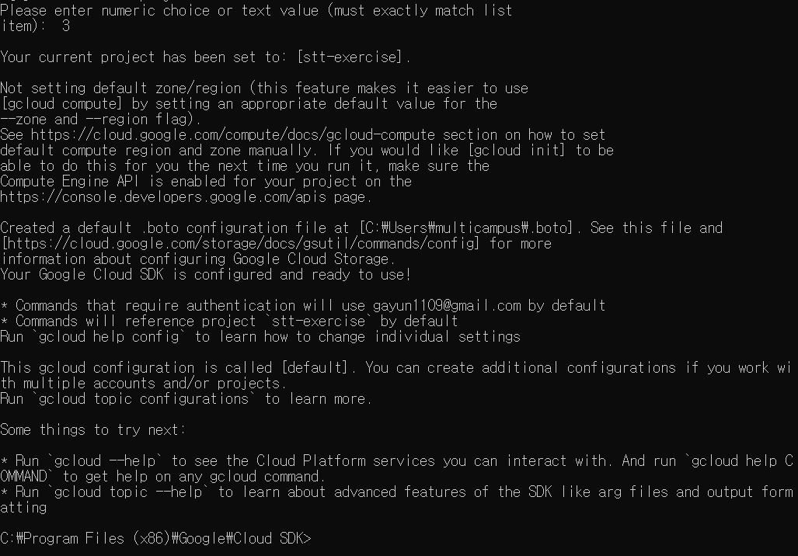
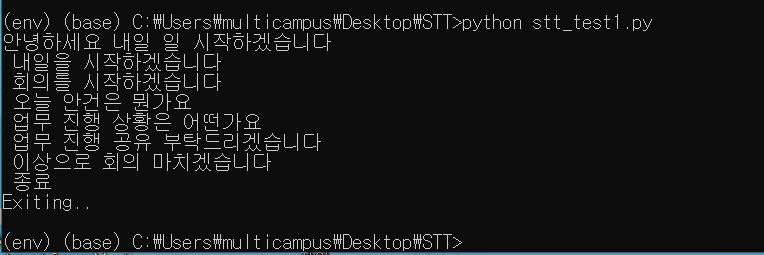

## 1. Google Cloud Platform 가입

> https://console.cloud.google.com

1. 새 프로젝트 생성 및 billing account 등록

2. 검색창에서 **Cloud Speech-to-Text API** 입력 후 ENABLE 클릭
3. 메뉴바에서 사용자 인증 정보 > 사용자 인증 정보 만들기> 서비스 계정 선택
4. 서비스 계정 만들기
5. 역할 선택 > 소유자 > 계속
6. +키 만들기> JSON 선택
7. 비공개 키 speechtotext-.................json 파일 내 컴퓨터에 자동 저장
8. 다운로드 폴더 내 파일 접근
9. cmd 창 열기, 아래 명령어 입력

```
> set GOOGLE_APPLICATION_CREDENTIALS={json파일 위치}\{프로젝트 명}-.................json
```

1. cmd 창 닫으면다시 설정해주어야 하므로, 매번 입력하기 번거롭다면, 환경 변수 시스템 변수에 등록하기


## 2 Cloud SDK, Visual Studio C++ 설치

#### Cloud SDK 설치

>  https://cloud.google.com/sdk 

1. 시작 버튼> 왼족 메뉴 바 빠른시작 windows> Google Cloud SDK 설치 프로그램 다운
2. 자동 cmd 창 생성> y 입력> 접근 허용> 다시 cmd 창에서 사용할 프로젝트 번호 입력





#### Visual Studio C++설치

> https://support.microsoft.com/ko-kr/help/2977003/the-latest-supported-visual-c-downloads

1. x86 다운로드 후 설치


## 3. 가상환경 설정

#### 아나콘다 Prompt 창에서 실행

```python
> pip install virtualenv
```

```python
> pip install virtualenvwrapper-win
```


#### 프로젝트 폴더 생성

```python
> mkdir STT
```

```python
> cd STT
```


#### 가상환경 생성 및 라이브러리 설치

>  virtualenv {가상환경이름} => 가상환경 위한 도구들 install

```python
> virtualenv env
```

```python
> .\env\Scripts\activate
```

=> 경로 앞에 (env) 생성 확인


> 가상환경 나가고 싶다면,

```python
> deactivate
```


## 4. 라이브러리 및 패키지 설치

#### Google Cloud Client Library for Python 설치

```python
> pip install --upgrade google-cloud-storage
```

#### Cloud Speech API Client Library 설치

```python
> pip install google-cloud-speech
```

#### 서비스 계정 활성화

```python
> gcloud auth activate-service-account --key-file="json파일 위치"
```

#### 마이크 사용 위한 패키기 설치

```python
> pip install pyaudio
```


## 5. 음성인식 실행

> [https://findface.netlify.app/](https://www.youtube.com/redirect?q=https%3A%2F%2Ffindface.netlify.app%2F&event=video_description&redir_token=QUFFLUhqbm95a3RCTDJqak5fREF3WnAzWnB2VllxSTZSQXxBQ3Jtc0ttTURmeXF6d0plT2FYcDEyNzNQNng0c3JoSUpXQlpIcGFJVmxZYzFwY0pxLVdLY3I5UHphZEhveXZTSTVZMVRoQ29oM3FZVDRkb0pZNG9FeGtwTlROMzcwREw2WkZTMGxBamtOVDBycmRZbzJoek9kTQ%3D%3D&v=Ds-7D8d-FwA) 접속 후 STT 파일 다운로드> 프로젝트 폴더에 저장

>  https://github.com/googleapis/python-speech/blob/master/samples/microphone/transcribe_streaming_mic.py

위 링크 참고해서 stt_test1.py에 있는 enum, type 검색 후 => speech로 수정하기

####  실시간 음성 인식

```python
> python stt_test1.py
```

=> 음성 인식 확인하기



####  .wav 확장자의 녹음 파일 텍스트화 실행

```python
> python sound_recorder.py
```

=> 녹음 후 현재 폴더에 file.wav 파일 생성

```python
> python quickstart.py
```

혹은

```python
> python stt_test2.py
```

실행 후 음성 인식 확인하기