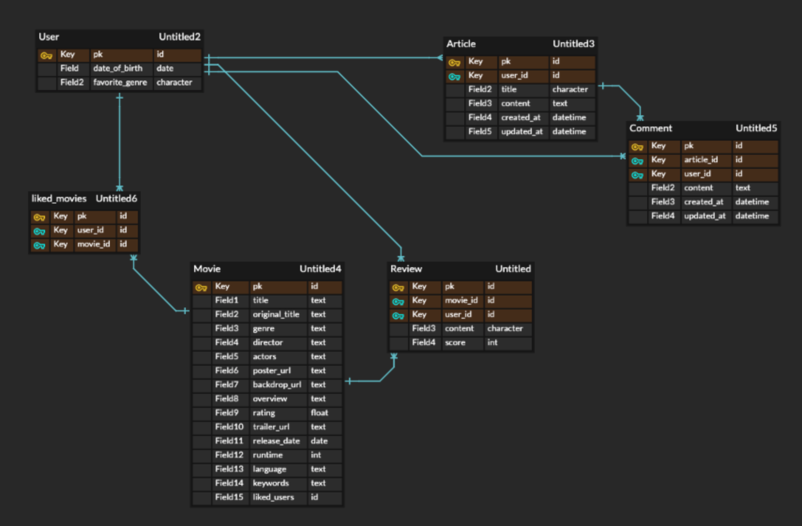

## Final_PJT

- 팀원 정보 및 업무 분담 내역

  - 가윤: 회원인증관리 구현 `accounts`, 게시판 기능 구현 `articles`

  - 채원: 추천알고리즘 구현, 데이터 수집 및 정제, 영화 관련 기능 구현 `movies`

    

- 목표 서비스 구현 및 실제 구현 정도

  - 목표: TMDB 영화 정보 API 기반 영화 추천 커뮤니티 웹 페이지 구현
  - 실제 구현: 필수 기능들 구현 완료 + 추가기능(`좋아요`, `예고편` 등)

- 데이터베이스 모델링

  - `Accounts`
    
    - User
  - `Articles`
    - Article
    - Comment
  - `Movies`
    - Movie
  
    - Review
  
      

- 필수 기능

  - 관리자 뷰

    `Django`에서 `superuser`를 생성해 `admin`페이지에서 영화와 유저 관리 권한을 가집니다.

  - 영화 정보

    TMDB API를 활용하여 3만개 이상의 영화 정보를 `수집`, `가공` (필요한 필드 선택적 수집, 데이터 형식 가공 등) 및 데이터베이스에 `저장` 했습니다.

  - 추천 알고리즘

    - 로그인 시 `생일`과 `선호 장르`를 선택하고, 이를 바탕으로 생일과 개봉일이 같은 영화 추천 및 선호 장르와 일치하는 영화들 추천

    - 로그인 후 `좋아요` 한 영화를 바탕으로 같은 영화를 `좋아요` 한 다른 유저들이 `좋아요` 한 영화들을 홈페이지 메인화면에서 추천(만약 10개가 넘는다면, 유저가 선호하는 장르와 일치하는 영화들로 선정 후 추천함)

  - 커뮤니티(인증된 사용자만 가능)

    - 게시글 `CRUD`(생성,조회,수정,삭제) 구현

    - 댓글 `CRD`(생성,조회,삭제) 구현

  - 기타

    - `홈페이지`

      -홈페이지에서는 최신작을 오늘 날짜로부터 최근 개봉된 10개의 영화들을 보여줍니다.

      -로그인 한 유저라면, 최신작 위로 유저가 선호하는 장르의 영화들 10개를 보여줍니다.

    - `Mypage`

      -유저 아이디와 함께 웹 사이트 가입일, 선호 장르 정보를 보여줍니다.

      -`좋아요` 한 영화 목록들과 생일(연도까지 같다면 생년월일)과 같은 개봉일의 영화 목록을 보여줍니다.

    - `Movies` 

      -가장 `좋아요`를 많이 받은 영화들 TOP12개를 보여줍니다.

      -해당 페이지에서 영화 제목을 검색하면 영화 상세페이지로 이동합니다.

    - `영화 detail `

      -모든 영화 이미지를 클릭하면 detail페이지로 넘어갑니다.

      -영화 상세 정보를 볼 수 있고, `좋아요`와 `좋아요 취소`가 가능하며 `좋아요 수` 를 나타냅니다. 

      -영화 예고편 보기가 가능합니다.

      -영화 한줄평을 작성할 수 있으며, 이 때 랭크를 0에서 10까지 선택할 수 있습니다.

      -랭크 순위에 따라 얼굴 이모티콘이 바뀌며, 해당 순위는 영화에 바로 반영됩니다.

    - `Community`

      -로그인 한 유저는 게시글을 자유롭게 작성할 수 있으며, 제목 클릭 시 게시글 detail 페이지로 이동해서 작성자만 게시글 수정 및 삭제할 수 있는 권한이 있습니다.

      -로그인 한 유저만 해당 게시글에 대한 댓글을 작성할 수 있으며 작성자에 한해 댓글을 삭제할 수 있습니다.

  

  

- 배포 서버 URL

  > http://ssafy-finalpjt-vue.s3-website.ap-northeast-2.amazonaws.com/

  

- 느낀점

  이번 프로젝트는 처음으로 vuex와 django를 사용해서 개발을 했습니다. 솔직히 처음에는 vue와 django로 함께 개발한다는 게 얼마나 어려운 일인지 모른 채 1학기 마지막 프로젝트인 만큼 challenge를 경험해보고 싶었습니다. 두 가지 프레임워크를 모두 사용하면 개발도 각각 하고, 오류해결도 각각 처리해야 하기 때문에 시간이 2배로 걸린다고 했지만, 제가 끝까지 고집을 부려 두 가지 프레임워크로 개발을 시작하게 되었습니다. 

  처음 프로젝트 시작 전 짧게나마 vuex를 공부할 수 있었고, vuex에 대한 기초를 바탕으로 저는 `accounts`와 `articles` 파트를 맡아 진행했습니다. 처음 시작은 수월한 듯했지만, Live 강의 때 다루지 못한 부분들, 예를 들어서 signup 폼에서 정보를 추가로 받아 user data에 새로운 필드로 저장하는 것 혹은 댓글 기능 구현 등에서 challenge를 만나 좌절하는 순간도 있었습니다.

  하지만 pair-programming 프로젝트인 만큼, 이번 프로젝트를 통해 저의 짝꿍 채원님에게 정말 많은 것을 배웠습니다. 각자 파트를 나누어서 개발을 맡고 제가 해결하지 못하는 부분에 대해 도움을 청하면 언제나 명쾌한 해답을 제시해 주었습니다. 프로젝트를 진행하며 저의 개발 속도나 완성도 면에서 채원님을 따라갈 수 없었기 때문에, 제가 많이 기여하지 못한 것 같아 미안했고 제가 신경쓰지 못한 많은 부분을 채워준 것에 고마웠습니다.

  또한, 이번 프로젝트의 협업을 위해 git을 사용했고, git 사용법에 대해 많이 배울 수 있었습니다. 특히 협업을 할 때 같은 공간에서 작업하는 것을 지양해야 하고, 너무 많은 수정사항들이 발생하면 git에서 merge를 거부하고, 결국 local에서 해야 한다는 점, 그래서 중간중간 틈틈이 merge해야 한다는 점을 깊이 배웠습니다.

  SSAFY에서의 1학기를 이번 마지막 프로젝트로 마무리 할 수 있어서 뜻 깊었고, 개발의 1도 몰랐던 제가 6개월 동안 열심히 노력한 끝에 이렇게 번듯한 결과물을 만들어 냈다는 점에서 그동안 힘들게 공부한 보람을 느꼈습니다.

  앞으로 2학기는 라이브 강의나 전담 교수님의 도움없이 교육생들끼리 스스로 공부하며 프로젝트를 수행해야 하는데, 약간의 두려움 반 기대감 반입니다. 프로젝트를 수행하며 또 얼마나 많은 삽질을 할 지 알 수 없지만, 그만큼 제가 진짜 개발자로 성장하는데 밑거름이 된다고 생각합니다. 1학기 때 배운 것을 바탕으로 멋진 프로젝트를 수행할 2학기가 기대가 됩니다:)
