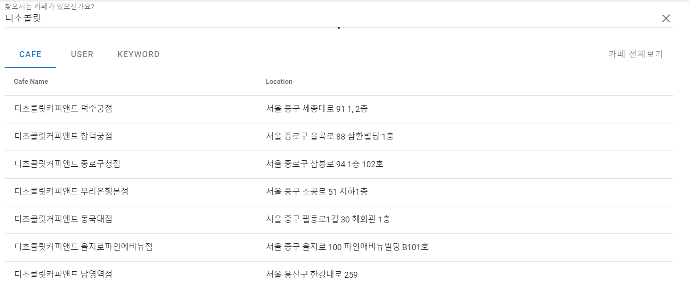
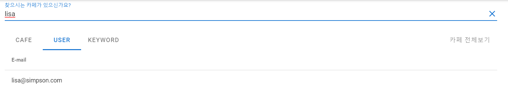
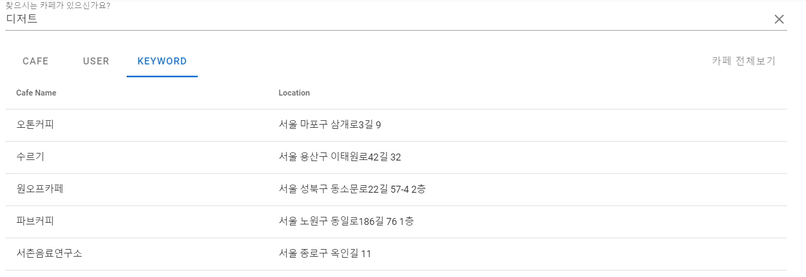
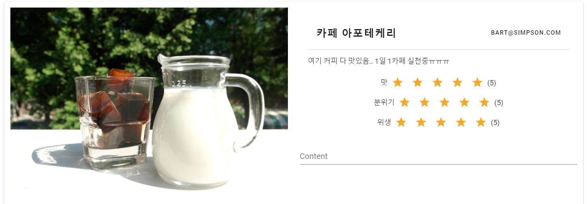
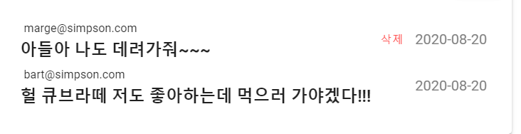
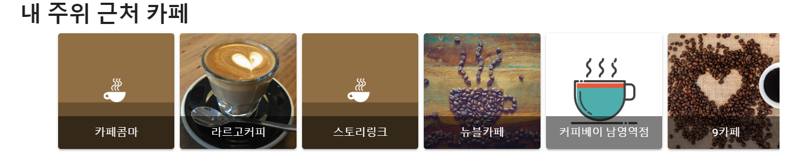
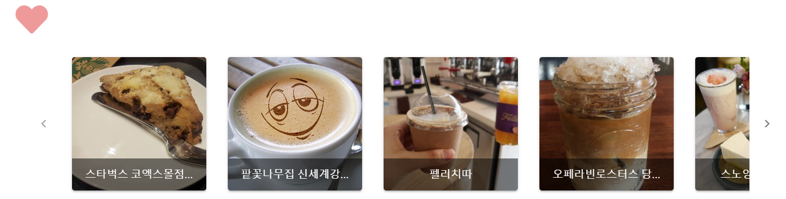
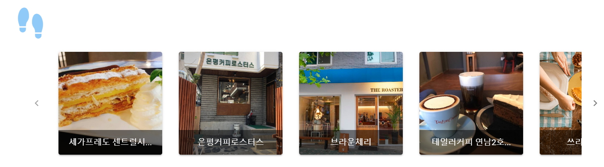
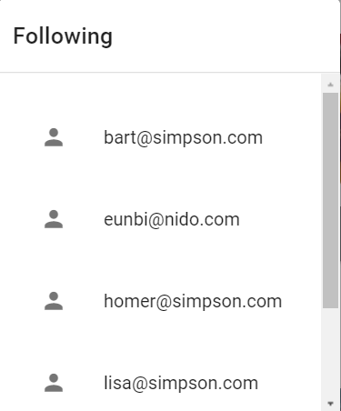
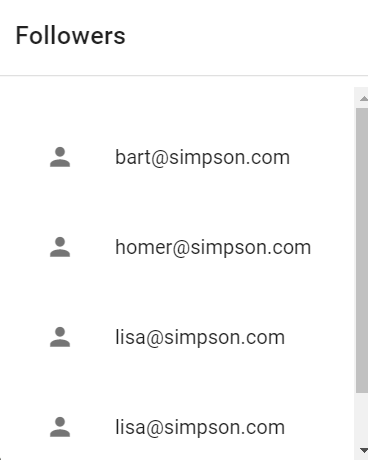

[](https://hits.seeyoufarm.com)
[]

<div align=center>


# Cafe SNS Project

## [Cafe人](https://i3a203.p.ssafy.io)

</div>

# <span style="color:orange; font-size:17pt; font-weight:bold"> 프로젝트 소개 </span>

- 사용자의 성향 에 맞는 다양한 카페들을 추천 해주는 서비스 Cafe 人
- 맞춤형 카페 를 선정해 카페와 사람을 잇다
- 카페인처럼 한 번 빠지면 헤어나오지 못하는 중독성이 강한 서비스
  <br>


## 주요 기능

### 카페 정보 제공

- 서울 주요 카페 정보 제공
- 카페 리뷰 기반 키워드 추출
- 키워드 기반 5가지 유형 카페 분류
- 리뷰가 추가 됨에 따라 계속해서 갱신되는 키워드!

### 카페 추천
- 설문 진행 후, 결과 유형별 맞춤형 카페 추천
- 좋아요(LIKE), 발도장(STAMP) 카페 기반 협업 필터링 추천
- 최다 및 최신 좋아요, 발도장 카페 추천

---

<br><br>

# <span style="color:orange; font-size:17pt; font-weight:bold"> 사용 언어 및 기술 스택 </span>

## 사용언어 & 프레임 워크 & API

### 카페 추천
- 설문 진행 후, 결과 유형별 맞춤형 카페 추천
- 좋아요(LIKE), 발도장(STAMP) 카페 기반 협업 필터링 추천
- 최다 및 최신 좋아요, 발도장 카페 추천

---
   
<br><br>

# <span style="color:orange; font-size:17pt; font-weight:bold"> 사용 언어 및 기술 스택 </span>
## 사용언어 & 프레임 워크 & API
### FrontEnd


vuecookies, infinitscroll

### BackEnd


mybatis

### Data

konlpy, selenium, openpyxl, networkx, hanspell

<br>


<br>

# <span style="color:orange; font-size:17pt; font-weight:bold"> Install </span>

## BackEnd(Spring)

Jenkins를 이용하여 push 할때 마다 자동으로 빌드
Jenkins, BackEnd Spring 서버 모두 Docker로 작성

1. Dockerfile 작성
<details>
<summary>Dockerfile</summary>
<div markdown="1">

```Docker
# Start with a base image containing Java runtime
FROM java:8

# Add Author info
LABEL maintainer="xxx@gmail.com"

# Add a volume to /tmp
VOLUME /tmp

# Make port 8080 available to the world outside this container
EXPOSE 8080

# The application's jar file
ARG JAR_FILE=target/spring_back_team-0.0.1-SNAPSHOT.jar

# Add the application's jar to the container
ADD ${JAR_FILE} cafesns-springboot.jar

# Run the jar file
ENTRYPOINT ["java","-Djava.security.egd=file:/dev/./urandom","-jar","/cafesns-springboot.jar"]
```

</div>
</details>
<br>

2. Shell Script 작성

<details>
<summary>Shell Script</summary>
<div markdown="1">

```Bash
#!/bin/bash

docker stop spring
docker rm spring
docker rmi cafesns-springboot
docker build -t cafesns-springboot . && docker run --name spring -d -v /home/ubuntu/data/thumb_img:/home/data/thumb_img -v /var/www/i3a203.p.ssafy.io:/var/www/i3a203.p.ssafy.io -v /home/ubuntu/data/images:/home/data/images -v /home/ubuntu/env:/home/env -p 5000:8080 cafesns-springboot
```

</div>
</details>
<br>
<br>

## Mysql Server 설치

Mysql은 설정할게 많아서 docker-compose를 이용해서 작성해보았다

1. Docker-compose 작성

<details>
<summary>Docker-compose</summary>
<div markdown="1">

```Docker
# docker-compose.yml
version: "3" # 파일 규격 버전
services: # 이 항목 밑에 실행하려는 컨테이너 들을 정의
    db:
      image: mysql:8.0.17 # 사용할 이미지
      container_name: db # 컨테이너 이름 설정
      ports:
              - "3306:3306" # 접근 포트 설정 (외부:내부)
      environment: # -e 옵션
        MYSQL_ROOT_PASSWORD: "xxx" # MYSQL PW 설정
        MYSQL_DATABASE: "cafeproject"
      command: # 명령어 실행
        - --character-set-server=utf8mb4
        - --collation-server=utf8mb4_unicode_ci
      volumes:
        - /home/ubuntu/docker/data:/var/lib/mysql # -v 옵션
```

</div>
</details>
<br>

2. 실행
   docker로 서버를 올리고 외부에서 접속할 수 있도록 계정을 만들고 권한을 설정한다.

```
$ docker-compose up -d
$ docker exec -it db bash
$ mysql -u root -p

mysql> CREATE user 'jiho'@'%' IDENTIFIED BY 'xxxx';
mysql> GRANT ALL PRIVILEGES ON cafeproject.* To 'jiho'@'%';
mysql> flush privileges;
```

## FrontEnd(Vue.js)

Vue도 Docker를 이용하여 생성한다

1. Dockerfile 작성

<details>
<summary>Dockerfile</summary>
<div markdown="1">

```Docker
# build stage
FROM node:lts-alpine as build-stage
WORKDIR /app
COPY package*.json ./
RUN yarn install
COPY . .

#RUN npm install @vue/cli-service
#build stage
RUN yarn build

# production stage
FROM nginx:stable-alpine as production-stage
COPY --from=build-stage /app/dist /usr/share/nginx/html
EXPOSE 80
CMD ["nginx", "-g", "daemon off;"]
```

</div>
</details>
<br>
<br>

2. 자동 빌드를 위한 Shell Script 작성
<details>
<summary>Shell Script</summary>
<div markdown="1">

```Bash
#!/bin/bash
app_name='vuejs-app'
image_name='cafesns-vuejs'
docker stop ${app_name}
docker rm ${app_name}
docker rmi ${image_name}

repository_name='s03p12a203'

if [ -d ${repository_name} ]; then
        rm -rf ${repository_name}
fi

git clone -b frontend --single-branch https://lab.ssafy.com/s03-webmobile2-sub2/${repository_name}.git && cd ${repository_name}/vue_front/cafesns
docker build -t ${image_name} . && docker run -d -it -p 80:80 -v /home/ubuntu/data/thumb_img:/home/data/thumb_img -v /home/ubuntu/docker/nginx/conf:/etc/nginx/conf.d --name ${app_name} ${image_name}
```

</div>
</details>

<br>
<br>

# <span style="color:orange; font-size:17pt; font-weight:bold"> Cafe人 서비스 </span>

## <span style="color:blue; font-size:17pt; font-weight:bold"> 검색 </span>

- 카페 정보 검색
  서울의 약 27000개의 카페들 정보를 검색할 수 있다
- 카페 이름
- 카페 썸네일
- 카페 운영 시간
- 전화 번호
- 주소
- 메뉴 및 가격
- 키워드
  <br>

카페 검색 결과
---


<br>

- 유저 검색
  Cafe 을 이용하는 다른 사용자를 검색할 수 있다.
  <br>

유저 검색 결과
---


<br>

- 키워드 검색
  키워드를 통해 카페를 검색할 수 있다.  
  디저트가 맛있는 카페를 알고 싶다면 '디저트'라는 키워드를 검색해라
  <br>

키워드 검색 결과

<br>

## <span style="color:blue; font-size:17pt; font-weight:bold"> 등록 </span>

- 포스트(리뷰) 등록 
  카페에 대한 리뷰를 **사진**, **별점** 과 함께 남길 수 있다.
  포스트 수정도 가능하다
  <br>

포스트 보기
---


<br>

- 댓글 등록
  각 포스트에 대해서 댓글을 달 수 있다. 이를 통해 유저들 끼리 정보를 공유할 수 있다.  
  또한 자신이 단 댓글은 삭제 가능하며 작성 날짜를 확인할 수 있다.
  <br>


<br>

## <span style="color:blue; font-size:17pt; font-weight:bold"> 추천 </span>

- 설문을 통한 추천
  재밌는 설문을 통해서 5가지 유형으로 나누어 추천을 해준다
  <br>

설문 시작
---


<br>

설문 결과
---

<br>

- 좋아요(Like)가 많은 카페 추천
  카페의 좋아요 수가 많은 카페들을 추천해준다.

- 사람들이 제일 많이 다녀간 카페 추천
  사람들이 다녀갔다고 발도장을 찍은 카페들을 추천해준다.

- 요즘 핫한 카페
  사람들이 최근에 가장 많이 다녀간 카페를 보여준다.

- 근처 카페
  위치 기반으로 현재 위치 주변의 카페들을 추천해준다.

근처 카페 추천
---


<br>

## <span style="color:blue; font-size:17pt; font-weight:bold"> 내 정보 </span>

- 좋아요한 카페
  자신이 좋아요를 누른 카페들 목록을 볼 수 있다.
  <br>

좋아요한 카페
---


<br>

- 다녀간 카페
  자신이 다녀갔다고 발도장을 남긴 카페들을 볼 수 있다
  <br>

다녀간 카페
---


<br>

- 팔로잉
  다른 유저를 팔로잉하여 다른 사람의 게시글들과 다녀간 카페 정보들을 확인할 수 있다.  
  또한 자신을 팔로우하는 유저들도 확인할 수 있다.

<br>

팔로잉
---

<br>

팔로워
---
>
<br>

# <span style="color:orange; font-size:17pt; font-weight:bold"> 앞으로 개선/추가 해야할 점</span>

1. 최근 핫한 카페 추천 로직을 좀 더 구체화 할 필요가 있다.
   한 동안 사용한 유저가 없다면 최근이 예전이 될 수가 있다.  
   <br>


2. 마이페이지
   프로필 사진을 추가하고 정보를 더 기입할 수 있게 하면 좋겠다.
   <br>

3. 대댓글 작성
   현재는 댓글만 작성이 가능하다
   <br>

4. 유저 태그
   같이 가고 싶은 유저, 같이 갔던 유저들을 태그하여 좀 더 소통할 수 있도록 하고 싶다.
   <br>

5. 알림
   내 게시물에 누가 댓글을 달았다거나 하면 알려주는 기능이 있으면 좋겠다.  
   이를 카카오톡 친구를 이용하여 할수도 있을것 같다.
   <br>

6. 새로고침
   갑자기 댓글을 달아도 새로고침을 해야지만 보인다... 제일 먼저 고쳐야 할듯...ㅠㅠ
   <br>

7. 더 많은 stopword
   좀 더 질이 좋은 키워드를 뽑아내기 위해서 stopword도 많이 설정되어야 한다.
   <br>

8. 소셜 로그인
   소셜 로그인 기능도 있다면 편리할 것 같기도 하다!!
   <br>
