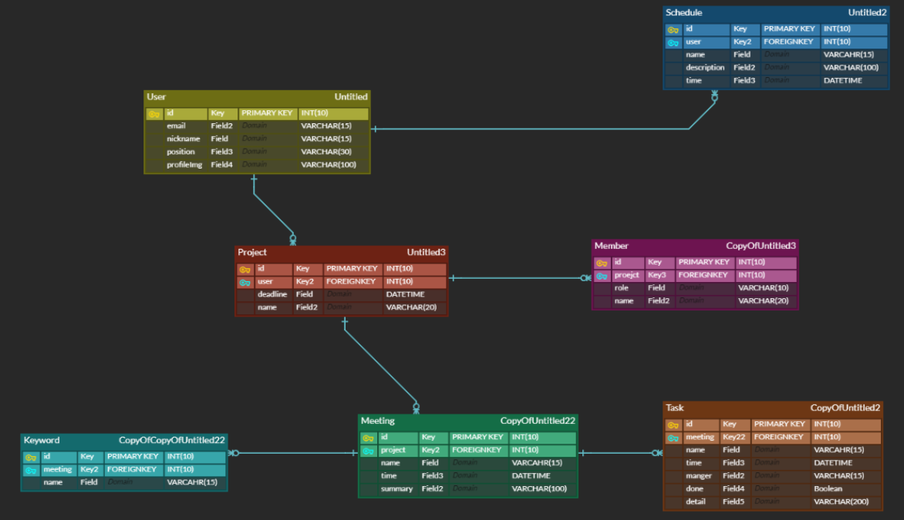
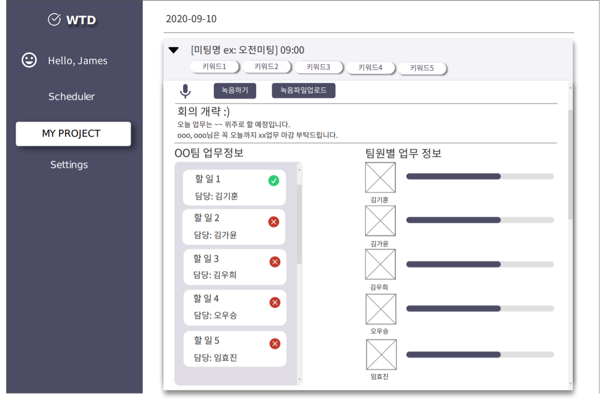

## 자동 일간 회의록 서비스 W.T.D (What To Do)

> 회의를 음성인식하여 자동으로 업무를 생성하고 관리할 수 있게하는 서비스

### 목차

- [개요](#-개요)
- [팀원소개](#-팀원-소개)
- [기술 스택](#-기술-스택)
- [와이어프레임 및 ERD 다이어그램](#-와이어프레임-및-erd-다이어그램)
- [Convention](#-convention)
- [개발계획](#-개발-계획)
- [회의록](#-회의록)

### :black_nib: 개요

> 회의를 통해 나온 하루의 To Do List를 자동 생성하고 관리하자

    
기획안

    <ul>
        <a href="Document/Proposal/WTD 기획안.md"><li>WTD기획안</li></a>
    </ul>

### 👨‍👨‍👧‍👦 팀원 소개

**김기훈**

**김가윤**

**김우희**

**오우승**

**임효진**

### 🔧 기술 스택

- Front-end
  - Vue CLI: 4.3.1
  - npm: 6.14.4
  - Vuex
  - Bootstrap 4
- Back-end
  - Django
  - python: 3.7.4
- STT Model
  - Google Cloud Speach API

### :bookmark_tabs: 와이어프레임 및 ERD 다이어그램

**[ERD 다이어그램]**

**[메인 기능 와이어프레임]**

    
와이어프레임

    <ul>
        <a href="Document/Specification/WTD와이어프레임.pdf"><li>와이어프레임</li></a>
    </ul>

### :pencil: Convention

    
개발 Convention

    <ul>
        <a href="Document/Convention/쌒쓰리 Convention.md"><li>개발 Convention</li></a>
    </ul>

### 📆 개발 계획

- 데이터 수집 및 Text Summarization 모델 구축
- STT 모델 API 활용
- 메인 기능 웹서비스로 구현

### 📒 회의록

    
1주차

    <ul>
        <a href="Document/Summary/2020-09-03_회의록.md"><li>2020-09-03_회의록</li></a>
        <a href="Document/Summary/2020-09-07_회의록.md"><li>2020-09-07_회의록</li></a>
        <a href="Document/Summary/2020-09-08_회의록.md"><li>2020-09-08_회의록</li></a>
        <a href="Document/Summary/2020-09-09_회의록.md"><li>2020-09-09_회의록</li></a>
        <a href="Document/Summary/2020-09-10_회의록.md"><li>2020-09-10_회의록</li></a>
        <a href="Document/Summary/2020-09-11 회의록.md"><li>2020-09-11_회의록</li></a>
        <a href="Document/Summary/2020-09-11 멘토링 피드백.md"><li>2020-09-11_멘토링 피드백</li></a>
        <a href="Document/Summary/2020-09-14 회의록.md"><li>2020-09-14_회의록</li></a>
        <a href="Document/Summary/2020-09-15 회의록.md"><li>2020-09-15_회의록</li></a>
        <a href="Document/Summary/2020-09-16 회의록.md"><li>2020-09-16_회의록</li></a>
    </ul>

