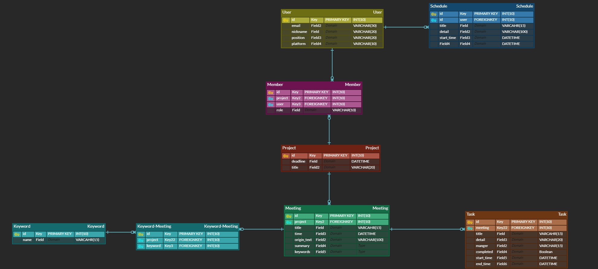
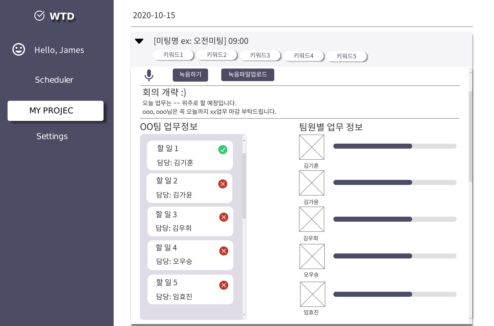

## 자동 일간 회의록 서비스 W.T.D (What To Do)

> 회의를 음성인식하여 자동으로 업무를 생성하고 관리할 수 있게하는 서비스

### 목차

- [개요](#-개요)
- [팀원소개 및 주요 역할](#-팀원-소개-및-주요-역할)
- [기술 스택](#-기술-스택)
- [와이어프레임 및 ERD 다이어그램](#-와이어프레임-및-erd-다이어그램)
- [Convention](#-convention)
- [개발계획](#-개발-계획)
- [회의록](#-회의록)

### :black_nib: 개요

> 회의를 통해 나온 하루의 To Do List를 자동 생성하고 관리하자

    
기획안

    <ul>
        <a href=""><li>계획서</li></a>
    </ul>

### 👨‍👨‍👧‍👦 팀원 소개 및 주요 역할

**임효진** 

> 프론트엔드

**김기훈**

> AI 모델 구축

**김가윤**

> 인프라 및 배포

**김우희**

> UI/UX

**오우승**

> 백엔드

### 🔧 기술 스택

- Front-end
  - Vue CLI: 4.3.1
  - npm: 6.14.4
  - Vuex
  - Vuetify
  - Bootstrap 4
- Back-end
  - Django
  - Sqlite3
  - python: 3.7.4
- AI Model
  - STT - Google Cloud Speach API
  - 키워드 추출 및 요약 - TextRank
  - AI 모델 - Tensorflow

### :bookmark_tabs: 와이어프레임 및 ER 다이어그램

**[ER 다이어그램]**

**[메인 기능 와이어프레임]**

    
와이어프레임

    <ul>
        <a href="Document/Specification/WTD와이어프레임.pdf"><li>와이어프레임</li></a>
    </ul>

### :pencil: Convention

    
개발 Convention

    <ul>
        <a href="Document/Convention/쌒쓰리 Convention.md"><li>개발 Convention</li></a>
    </ul>

    
API 명세

    <ul>
        <a href="Document/Specification/API.xlsx"><li>API 명세</li></a>
    </ul>

### 📆 개발 계획

| **시작일** | **종료일** |                           **내용**                           |
| :--------: | :--------: | :----------------------------------------------------------: |
|   10/12    |   10/16    | 기획, 와이어프레임, ERD 작성, 사전지식 학습, 개발 환경 구축  |
|   10/19    |   10/23    |     프론트엔드 / 백엔드 CRUD 개발 및 배포                    |
|   10/26    |   11/06    |         AI 모델링 및 데이터 작업,   프론트 개선작업          |
|   11/09    |   11/13    |          AI 모델링 고도화, UCC 준비, 사이트 런칭             |
|   11/16    |   11/20    |                 발표 자료 준비 및 UCC 제출                   |

### 📒 회의록

    
1주차

    <ul>
        <a href="Document/Summary/2020-10-13 회의록.md"><li>2020-10-13_회의록</li></a>
    </ul>

