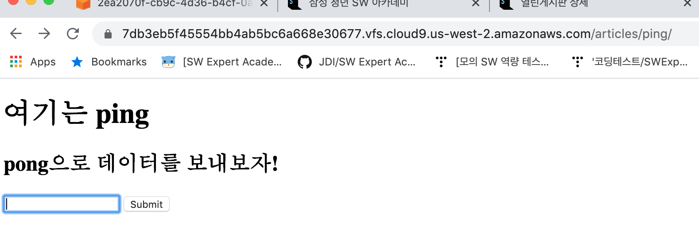
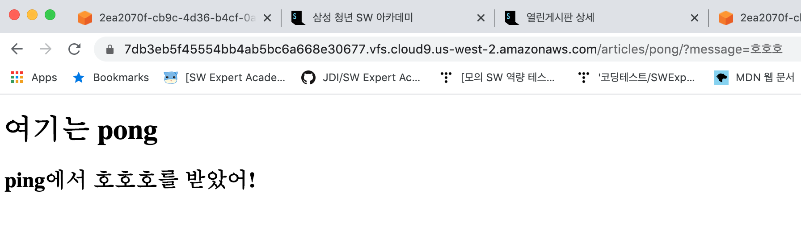

- ### views.py

  ```
  from django.shortcuts import render
  
  # Create your views here.
  def ping(request):
      return render(request, 'articles/ping.html')
  
  def pong(request):
      message = request.GET.get('message')
      #template 변수
      context = {
          'message' : message,
      }
      return render(request, 'articles/pong.html', context)
  ```

  

- ### crud/urls.py

  ```
  from django.urls import path
  from . import views
  
  urlpatterns = [
      path('pong/', views.pong),
      path('ping/', views.ping),
  
      ]
  ```

  

- ### articles/urls.py

  ```
  from django.contrib import admin
  from django.urls import path, include
  from articles import views
  
  urlpatterns = [
      path('articles/', include('articles.urls')),
      path('admin/', admin.site.urls),
  ]
  ```

  

- ### base.html

  ```
  <!DOCTYPE html>
  <html lang="en">
  <head>
      <meta charset="UTF-8">
      <meta name="viewport" content="width=device-width, initial-scale=1.0">
      <meta http-equiv="X-UA-Compatible" content="ie=edge">
      <title>Document</title>
  </head>
  <body>
      
      
  </body>
  </html>
  ```

  

- ### ping.html

  ```
  
  
  
  
  <h1>여기는 ping</h1>
  <h2>pong으로 데이터를 보내보자!</h2>
  <form action = "/articles/pong/">
      <input type="text" name = "message">
      <input type="submit">
  </form>
  
  
  ```

  

- ### pong.html

  ```
  
  
  
  <h1>여기는 pong</h1>
  <h2>ping에서 {{ message }}를 받았어!</h2>
  
  ```

  




