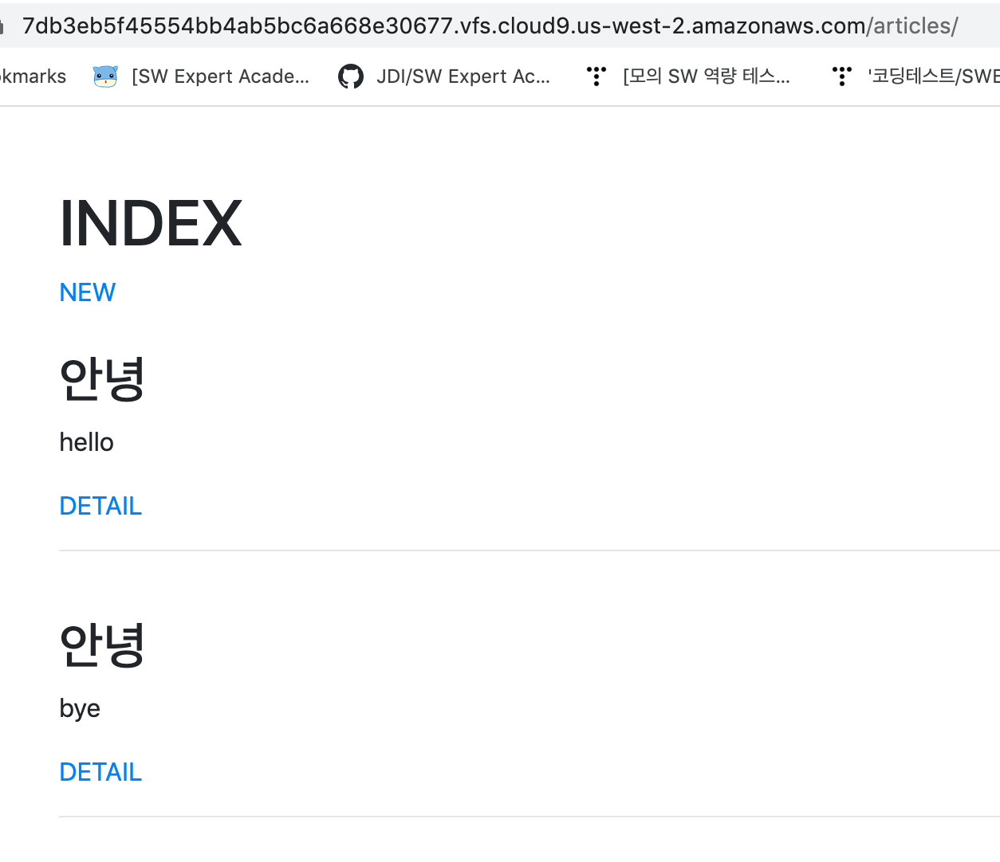
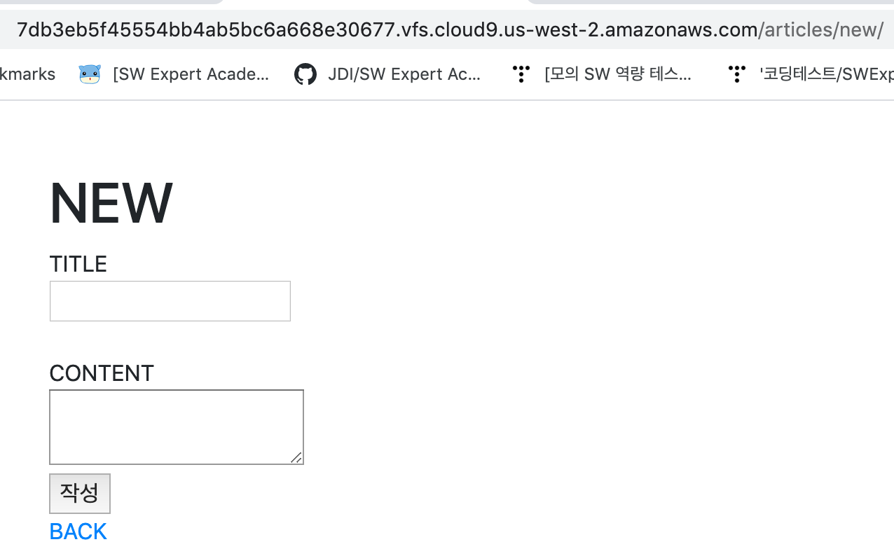
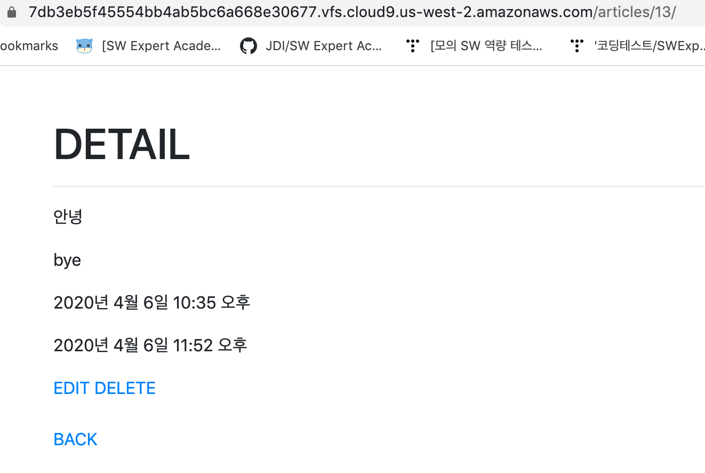
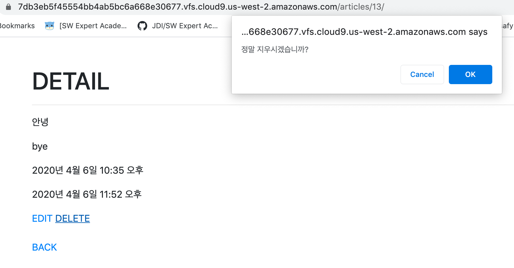
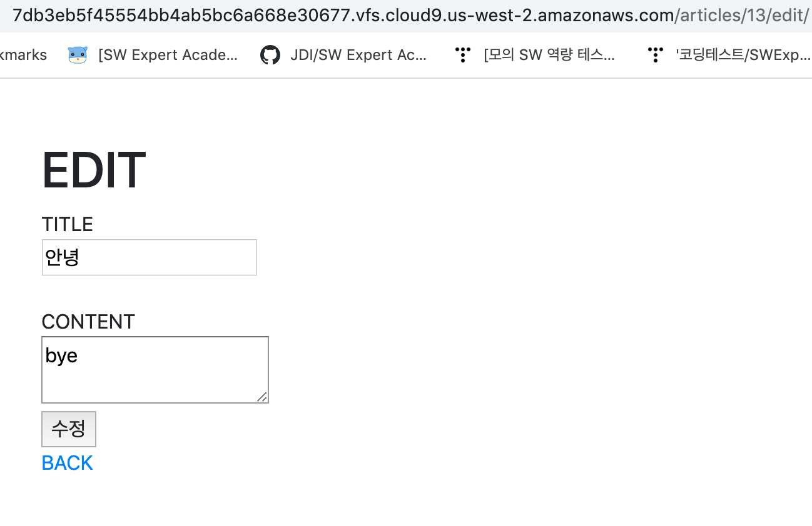
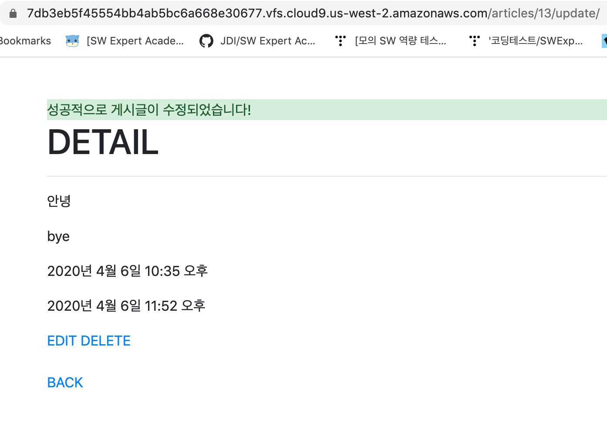

## crud/urls.py

```
from django.contrib import admin
from django.urls import path,include

urlpatterns = [
    path('articles/', include('articles.urls')),
    path('admin/', admin.site.urls),
]
```


## articles/urls.py

```
from django.urls import path
from . import views

app_name = 'articles'

urlpatterns = [
    path('', views.index, name='index'),
    path('new/', views.new, name='new'),
    path('create/', views.create, name='create'),
    path('<int:pk>/', views.detail, name='detail'),     #/articles/{{ article.pk }}/
    path('<int:pk>/delete/', views.delete, name='delete'),      #/articles/{{ article.pk }}/delete
    path('<int:pk>/edit/', views.edit, name='edit'),
    path('<int:pk>/update/', views.update, name='update'),

]
```


## views.py

```
from django.shortcuts import render, redirect
from .models import Article
from django.contrib import messages

# Create your views here.
def index(request):
    article = Article.objects.all()
    context = {
        'articles' : article
    }
    return render(request,'articles/index.html' ,context)


def new(request):
    return render(request,'articles/new.html' )


def create(request):
    title = request.POST.get("title")
    content = request.POST.get("content")
    article = Article()
    article.title = title
    article.content = content
    article.save()
    return redirect('articles:detail', article.pk)


def detail(request, pk):
    article =Article.objects.get(pk=pk)
    context ={
        'article': article,
    }
    return render(request, 'articles/detail.html', context)


def delete(request,pk):
    article = Article.objects.get(pk=pk)
    article.delete()
    return redirect('/articles/')


def edit(request,pk):
    article = Article.objects.get(pk=pk)
    context = {
        'article':article,
    }
    return render(request, 'articles/edit.html', context)


def update(request, pk):
    title = request.POST.get('title')
    content = request.POST.get('content')
    article = Article.objects.get(pk=pk)
    article.title = title
    article.content = content
    article.save()

    messages.success(request, '성공적으로 게시글이 수정되었습니다!')

    context = {
        'article': article,
    }

    return render(request, 'articles/detail.html', context)
```


## READ

- index.html

```



<h1>INDEX</h1>
<a href="">NEW</a>
    <br>
    
    <br>
    <h2>{{ article.title }}</h2>
    <p>{{ article.content }}</p>
    <a href = "">DETAIL</a>
    <hr>
    

```




## CREATE

- new.html

```



<h1>NEW</h1>
    <form action="" method="POST">
        
        TITLE<br>
        <input type="text" name="title"><br>
        <br>
        CONTENT<br>
        <textarea name="content"></textarea><br>
        <input type="submit" value="작성">
    </form>
<a href="">BACK</a>

```




## DETAIL

- detail.html

```



    
      
        <div class="arlet alert-success" role="alert">
            {{ message }}
        </div>
      
    
<h1>DETAIL</h1>
<hr>
    <p>{{ article.title }}</p>
    <p>{{ article.content }}</p>
    <p>{{ article.create_at }}</p>
    <p>{{ article.updated_at }}</p>

    <a href="">EDIT</a>
    <a href="" onclick="return confirm('정말 지우시겠습니까?')">DELETE</a><br>
    <br>
    <a href="">BACK</a>

```






## UPDATE

- edit.html

```



<h1>EDIT</h1>
    <form action="" method="POST">
        
        TITLE<br>
        <input type="text" name="title" value="{{ article.title }}"><br>
        <br>
        CONTENT<br>
        <textarea name="content">{{ article.content }}</textarea><br>
        <input type="submit" value="수정">
    </form>
<a href="">BACK</a>

```






