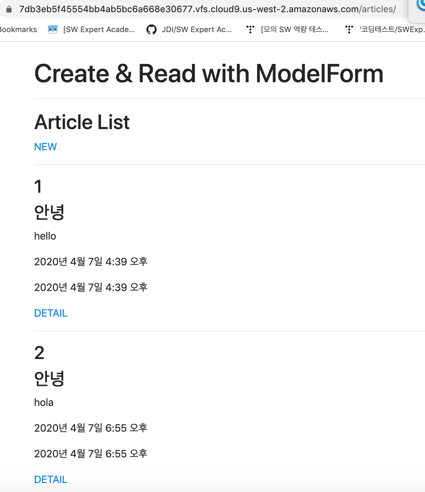
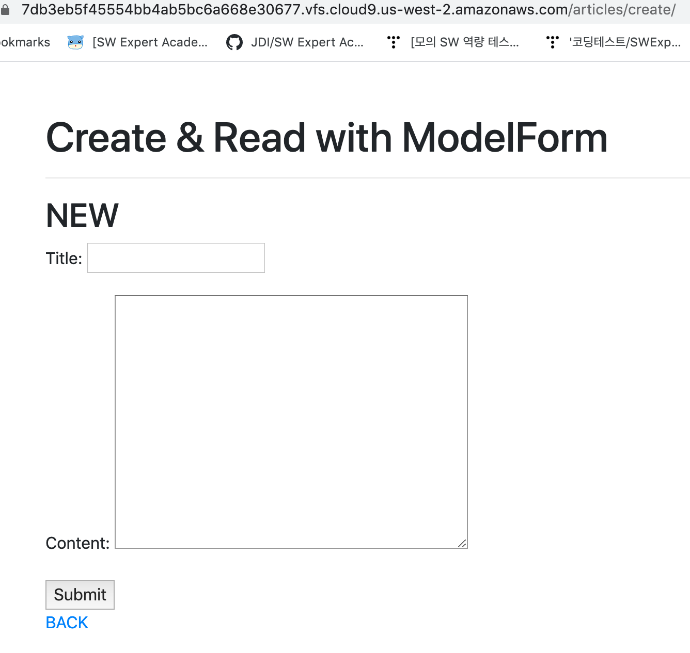
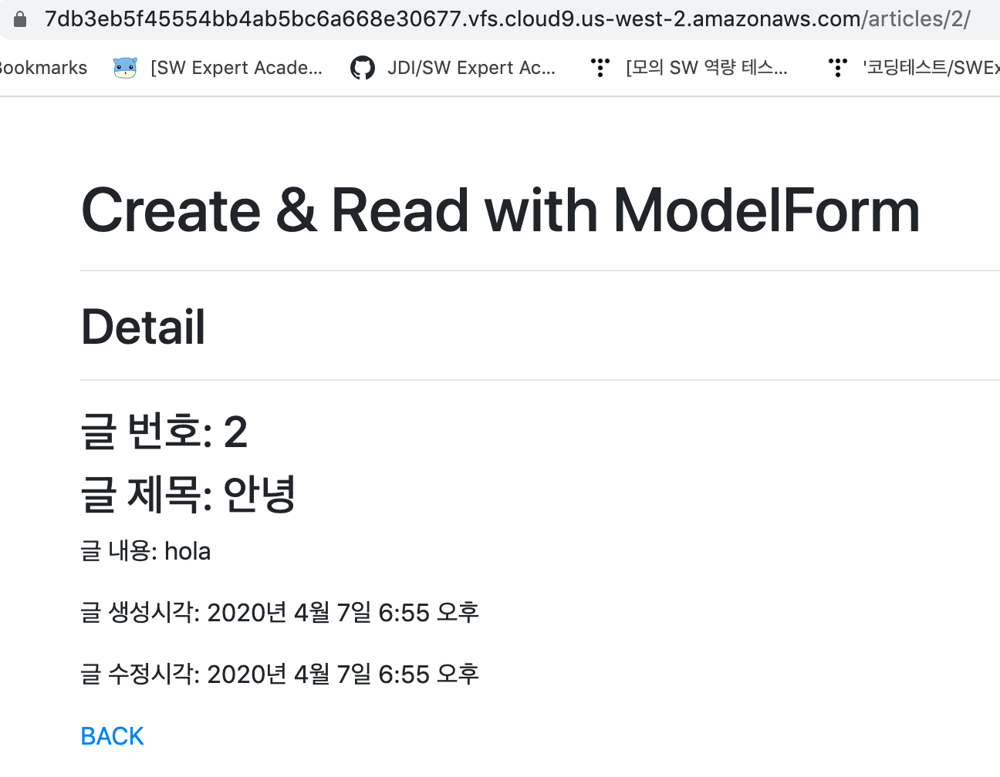

### views.py

```
from django.shortcuts import render,redirect
from .models import Article
from .forms import ArticleForm


# Create your views here.
def index(request):
    articles = Article.objects.all()
    context = {
        'articles':articles,
    }
    return render(request, 'articles/index.html', context)

#form 사용
def create(request):
    #1. POST 요청일 경우: 작성된 게시글이 온 경우
    if request.method == 'POST':
        form = ArticleForm(request.POST)
        if form.is_valid():
            form.save()
            return redirect('articles:index')
    #2. GET 요청일 경우: 게시글 작성 페이지 보여주기
    else:
        form = ArticleForm()
    context = {
        'form': form,
    }
    return render(request, 'articles/create.html', context)

def detail(request,pk):
    article = Article.objects.get(pk=pk)
    context = {
        'article': article,
    }
    return render(request, 'articles/detail.html', context)
```


### forms.py

```
from django import forms
from .models import Article
# from crispy_forms.helper import FormHelper
# from cistpy_forms.layout import Submit


class ArticleForm(forms.ModelForm):

    class Meta:  #django에서 정해놓은 것
        model = Article
        fields = '__all__'  #title,content포함
```







