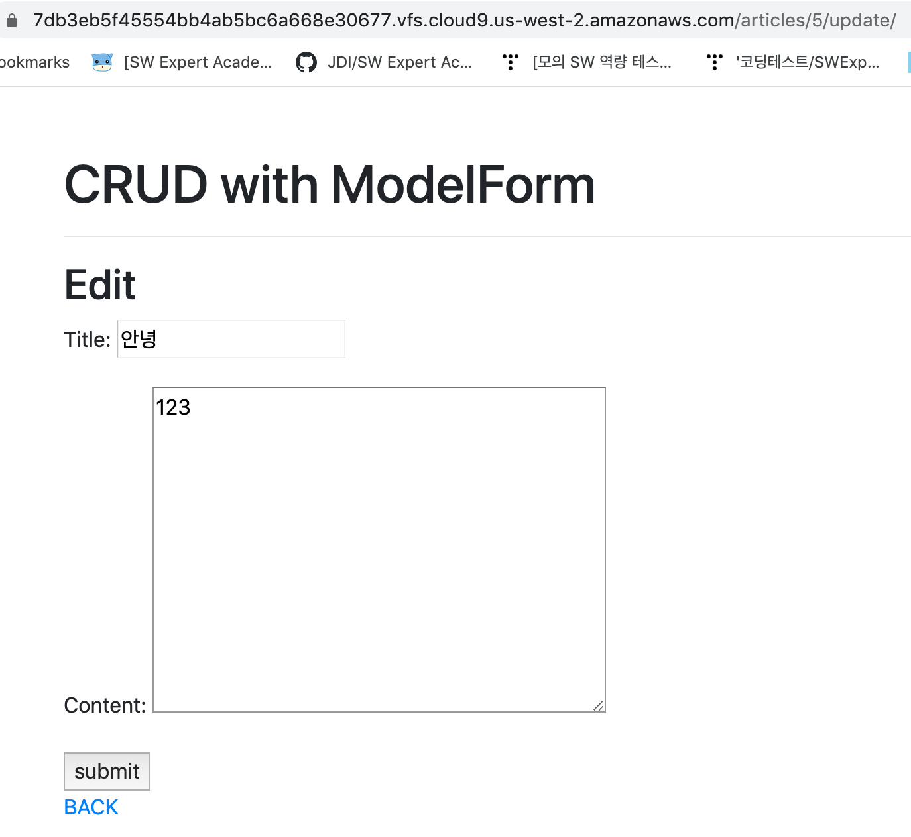

## urls.py

```
from django.urls import path
from . import views

app_name = 'articles'

urlpatterns = [
    path('', views.index, name="index"),
    path('create/', views.create, name="create"),
    path('<int:pk>/', views.detail, name="detail"),   #article/10/
    path('<int:pk>/delete/', views.delete, name="delete"),
    path('<int:pk>/update/', views.update, name="update"),
]
```


## views.py

```
from django.shortcuts import render,redirect, get_object_or_404
from django.views.decorators.http import require_POST
from .models import Article
from .forms import ArticleForm


# Create your views here.
def index(request):
    articles = Article.objects.order_by('-pk')
    context = {
        'articles':articles,
    }
    return render(request, 'articles/index.html', context)

#form 사용
def create(request):
    #1. POST 요청일 경우: 작성된 게시글이 온 경우
    if request.method == 'POST':
        form = ArticleForm(request.POST)
        if form.is_valid():
            form.save()
            return redirect('articles:index')
    #2. GET 요청일 경우: 게시글 작성 페이지 보여주기
    else:
        form = ArticleForm()
    context = {
        'form': form,
    }
    return render(request, 'articles/create.html', context)


def detail(request,pk):
    article = get_object_or_404(Article, pk=pk)
    context = {
        'article':article,
    }
    return render(request, 'articles/detail.html' , context)

@require_POST
def delete(request,pk):
    article = get_object_or_404(Article, pk=pk)
    article.delete()
    return redirect('articles:index')


def update(request,pk):
    article=get_object_or_404(Article, pk=pk)
    if request.method=='POST':
        form=ArticleForm(request.POST, instance=article)
        if form.is_valid():
            form.save()
            return redirect('articles:detail', article.pk)
    else:
        form=ArticleForm(instance=article)
    context = {
        'form':form,
    }
    return render(request,'articles/update.html' , context)
```


## forms.py

```
from django import forms
from .models import Article


class ArticleForm(forms.ModelForm):

    class Meta:  #django에서 정해놓은 것
        model = Article
        fields = '__all__'  #title,content포함
```


## index.html

```



    <h2>Article List</h2>
    <a href="">NEW</a>
        <hr>
        
            <h3>{{ article.title }}</h3>
            <p>{{ article.content }}</p>
            <p>{{ article.created_at }}</p>
            <p>{{ article.updated_at }}</p>
            <a href = "">DETAIL</a>
            <hr>
        

```


## create.html

```



    <h2>NEW</h2>
    <form action="" method="POST">
        
        {{ form.as_p }}
        <input type="submit">
    </form>
    <a href="">BACK</a>


```


## detail.html

```



<h2>Article Detail</h2>
<hr>
    <h3>글 번호: {{ article.pk }}</h3>
    <h3>글 제목: {{ article.title }}</h3>
    <p>글 내용: {{ article.content }}</p>
    <p>글 생성시각: {{ article.created_at }}</p>
    <p>글 수정시각: {{ article.updated_at }} </p>

    <form action="" method="POST">
        
        <input type="submit" value="DELETE">
    </form>
    <a href="">EDIT</a>
    <a href="">BACK</a>

```


## update.html

```



    <h2>Edit</h2>
    <form action="" method="POST">
    
    {{ form.as_p }}
    <input type="submit" value="submit">
    </form>
    <a href="">BACK</a>

```


