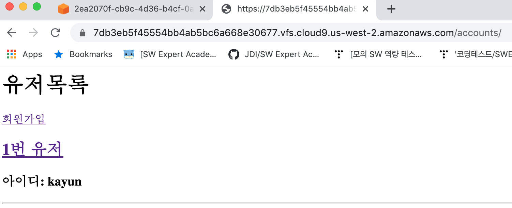
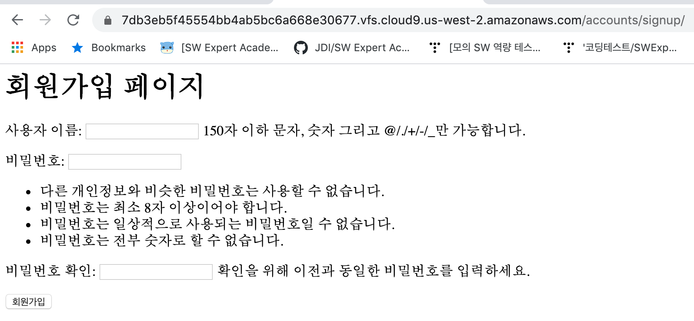
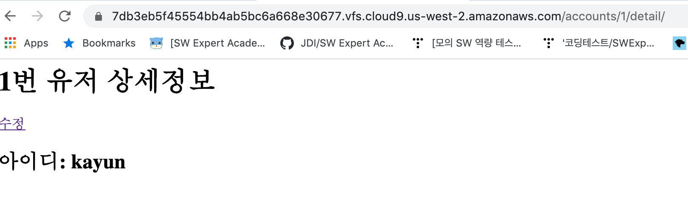
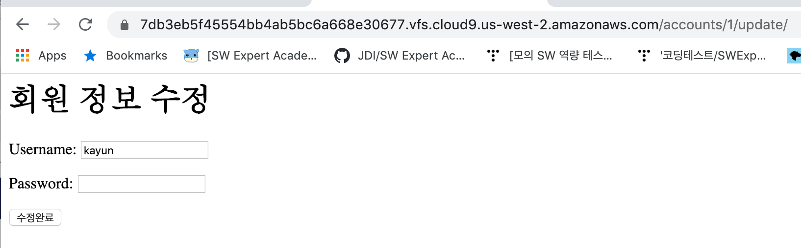

## views.py

```python
from django.shortcuts import render, redirect, get_object_or_404
from django.contrib.auth import get_user_model
from django.contrib.auth.forms import UserCreationForm
from .forms import CustomerUserChangeForm

# Create your views here.

def index(request):
    User = get_user_model()
    users = User.objects.all()
    context = {
        'users':users,
    }
    return render(request, 'accounts/index.html', context)

def signup(request):
    if request.method == 'POST':
        form = UserCreationForm(request.POST)
        if form.is_valid():
            form.save()
            #게시글 목록 페이지
            return redirect('/accounts/')
    else:
        form = UserCreationForm()
    context ={
        'form':form,
    }
    return render(request, 'accounts/signup.html', context)

def detail(request, pk):
    User = get_user_model()
    user = get_object_or_404(User, pk=pk)
    context = {
        'user':user,
    }
    return render(request, 'accounts/detail.html', context)

def update(request, pk):
    User = get_user_model()
    user = get_object_or_404(User, pk=pk)

    if request.method=='POST':
        form = CustomerUserChangeForm(request.POST, instance=user)
        if form.is_valid():
            form.save()
            return redirect('accounts:index')
    else:
        form = CustomerUserChangeForm(instance=user)
    context = {
        'form':form,
    }
    return render(request, 'accounts/update.html', context)
```









