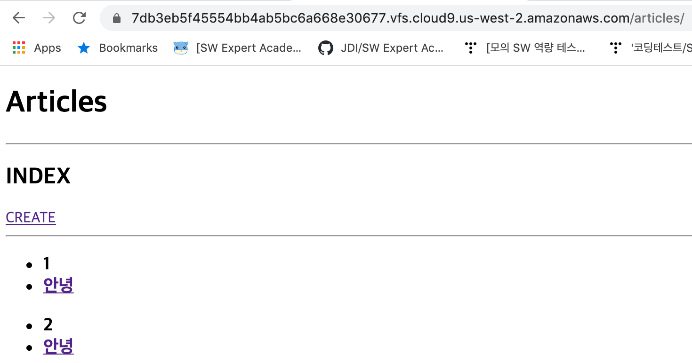
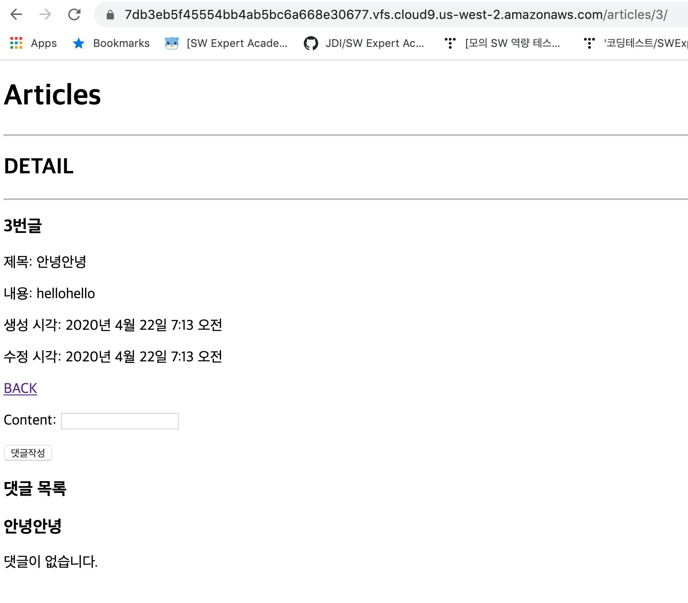
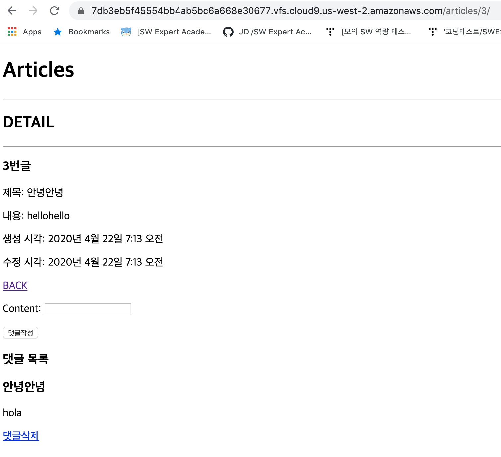

## models.py

```python
from django.db import models

class Article(models.Model):
    title = models.CharField(max_length=100)
    content = models.TextField()
    created_at = models.DateTimeField(auto_now_add=True)
    updated_at = models.DateTimeField(auto_now=True)

class Comment(models.Model):
    content = models.CharField(max_length=100)
    article = models.ForeignKey(Article, on_delete=models.CASCADE)
```


## views.py

```python
from django.shortcuts import render, redirect, get_object_or_404
from .models import Article, Comment
from .forms import ArticleForm, CommentForm

def index(request):
    articles = Article.objects.all()
    context = {
        'articles': articles,
    }
    return render(request, 'articles/index.html', context)

def create(request):
    if request.method == 'POST':
        form = ArticleForm(request.POST)
        if form.is_valid():
            article = form.save()
            return redirect('articles:detail', article.pk)
    else:
        form = ArticleForm()
    context = {
        'form': form,
    }
    return render(request, 'articles/form.html', context)

def detail(request, article_pk):
    article = get_object_or_404(Article, pk=article_pk)
    comment_form = CommentForm()
    context = {
        'article': article,
        'comment_form': comment_form,
    }
    return render(request, 'articles/detail.html', context)

def comment_create(request, article_pk):
    article = get_object_or_404(Article, pk=article_pk)
    if request.method=='POST':
        comment_form = CommentForm(request.POST)
        if comment_form.is_valid():
            comment = comment_form.save(commit=False)
            comment.article = article
            comment.save()
    return redirect('articles:detail', article_pk)

def comment_delete(request, article_pk, comment_pk):
    comment = Comment.objects.get(pk=comment_pk)
    comment.delete()
    return redirect('articles:detail', article_pk)
```


## forms.py

```python
from django import forms
from .models import Article, Comment

class ArticleForm(forms.ModelForm):
    class Meta:
        model = Article
        fields = '__all__'

class CommentForm(forms.ModelForm):
    class Meta:
        model = Comment
        fields = ('content',)
```









