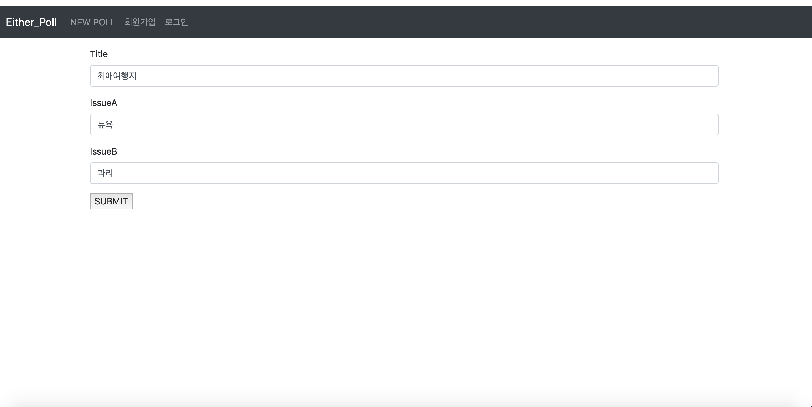
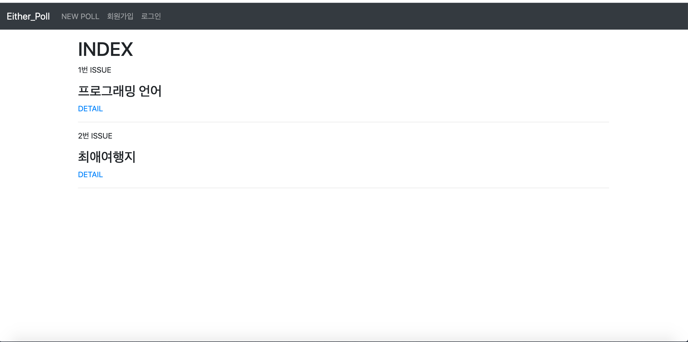
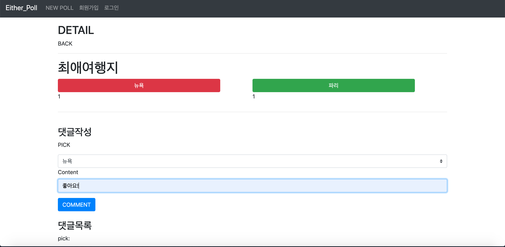
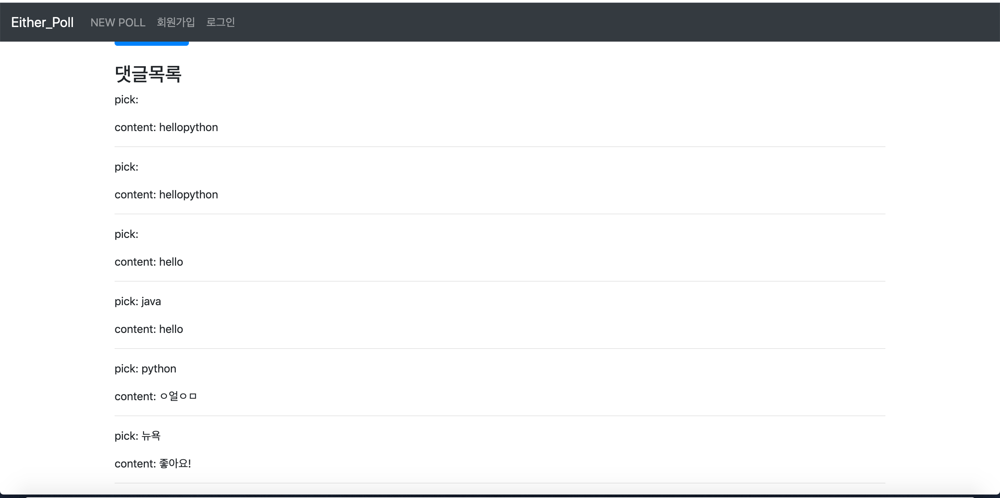

## views.py

```python
from django.shortcuts import render,redirect, get_object_or_404
from .models import Poll, Choice, Comment
from .forms import PollForm, ChoiceForm, CommentForm

# Create your views here.
def index(request):
    polls = Poll.objects.all()
    context = {
        'polls':polls
    }
    return render(request, 'polls/index.html', context)

def poll_detail(request, poll_pk):
    poll = get_object_or_404(Poll, pk=poll_pk)
    IssueA_cnt = poll.choice_set.filter(select=poll.IssueA).count()
    IssueB_cnt = poll.choice_set.filter(select=poll.IssueB).count()
    comment_form = CommentForm()
    context = {
        'poll':poll,
        'IssueA_cnt':IssueA_cnt,
        'IssueB_cnt':IssueB_cnt,
        'comment_form':comment_form,
        'IssueA_ratio': round(IssueA_cnt/(IssueA_cnt+IssueB_cnt)*100,2),
        'IssueB_ratio': round(IssueB_cnt/(IssueA_cnt+IssueB_cnt)*100,2),
    }
    return render(request, 'polls/poll_detail.html', context)

def random(request):
    poll = Poll.objects.order_by('?').first()
    IssueA_cnt = poll.choice_set.filter(select=poll.IssueA).count()
    IssueB_cnt = poll.choice_set.filter(select=poll.IssueB).count()
    comment_form = CommentForm()
    context = {
        'poll':poll,
        'IssueA_cnt':IssueA_cnt,
        'IssueB_cnt':IssueB_cnt,
        'comment_form':comment_form,
    }
    return render(request, 'polls/poll_detail.html', context)

def poll_create(request):
    if request.method=="POST":
        form = PollForm(request.POST)
        if form.is_valid():
            form.save()
            return redirect('polls:index')
    else:
        form = PollForm()
    context = {
        'form':form
    }
    return render(request, 'polls/poll_create.html', context)

def create_choice(request, poll_pk, select):
    poll = get_object_or_404(Poll, pk=poll_pk)
    choice = Choice()
    # choice.select = select
    choice.select = request.POST['issue']
    choice.poll = poll
    choice.save()
    return redirect('polls:poll_detail', poll_pk)

def comment_create(request, poll_pk):
    poll = get_object_or_404(Poll, pk=poll_pk)
    pick = request.POST.get('select')
    print(request.POST)
    if request.method=='POST':
        comment_form = CommentForm(request.POST)
        if comment_form.is_valid():
            comment = comment_form.save(commit=False)
            comment.poll = poll
            comment.pick = pick
            comment.save()
    return redirect('polls:poll_detail', poll_pk)

def comment_delete(request):
    pass
```








