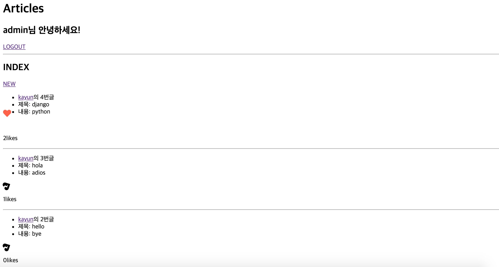
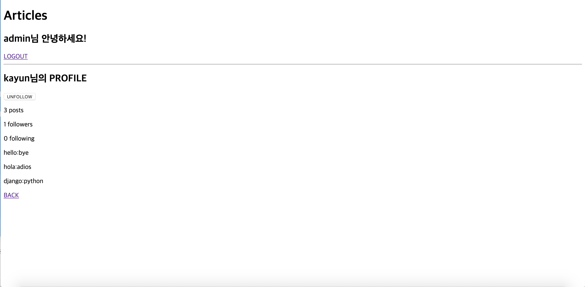

## views.py

```python
from django.shortcuts import render, redirect, get_object_or_404
from django.contrib.auth.forms import UserCreationForm, AuthenticationForm
from django.contrib.auth.decorators import login_required
from django.contrib.auth import login as auth_login, logout as auth_logout
from django.contrib.auth import get_user_model
from .forms import CustomUserCreationForm

def signup(request):
    if request.method == 'POST':
        form = CustomUserCreationForm(request.POST)
        if form.is_valid():
            user = form.save()
            auth_login(request, user)
            return redirect('articles:index')
    else:
        form = CustomUserCreationForm()
    context = {
        'form': form,
    }
    return render(request, 'accounts/signup.html', context)

def login(request):
    if request.method == 'POST':
        form = AuthenticationForm(request, request.POST)
        if form.is_valid():
            auth_login(request, form.get_user())
            return redirect('articles:index')
    else:
        form = AuthenticationForm()
    context = {
        'form': form,
    }
    return render(request, 'accounts/login.html', context)

@login_required
def logout(request):
    auth_logout(request)
    return redirect('articles:index')

@login_required
def profile(request, username):
    User = get_user_model()
    profile_owner = get_object_or_404(User, username=username)   # 프린트하면, 내부적으로 username이 출력됨
    context = {
        'profile_owner':profile_owner,
    }
    return render(request,'accounts/profile.html', context)

@login_required
def follow(request, username):
    User = get_user_model()
    user = get_object_or_404(User, username=username)
    if request.user != user:
        # if request.user in followers.all():
        if user.followers.filter(pk=request.user.pk).exists():
            user.followers.remove(request.user)
        else:
            user.followers.add(request.user)
    return redirect('accounts:profile', username)
```


## models.py

```python
from django.db import models
from django.conf import settings
from django.contrib.auth.models import AbstractUser


class User(AbstractUser):
    followers = models.ManyToManyField(settings.AUTH_USER_MODEL, related_name='followings')
```


## profile.html

```python



  <h2>{{ profile_owner }}님의 PROFILE</h2>
  
      
          <a href=""><button>UNFOLLOW</button></a>
      
          <a href=""><button>FOLLOW</button></a>
      
  
  <!--<p>{{ profile_owner.article_set.count }} posts</p>-->
  <p>{{ profile_owner.article_set.all|length }} posts</p>
  <p>{{ profile_owner.followers.all|length }} followers</p>
  <p>{{ profile_owner.followings.all|length }} following </p>
  
    <p>{{ article.title }}:{{ article.content }}</p>
  
  <p>{{ profile}}</p>
  <a href="">BACK</a>

```





