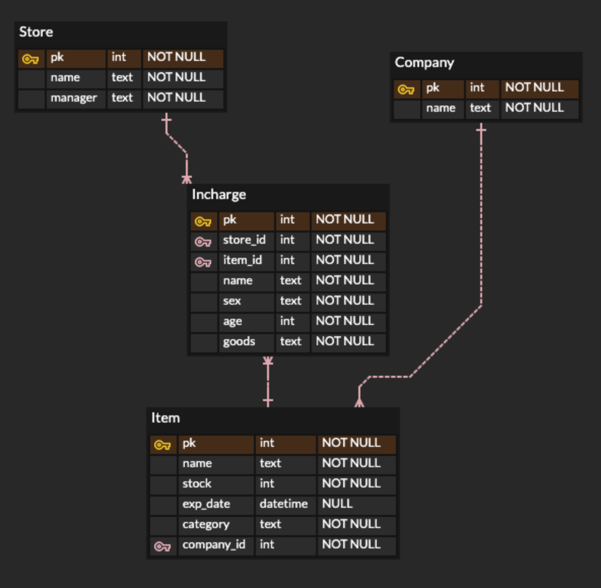
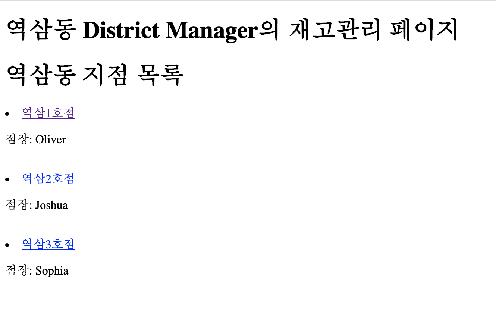
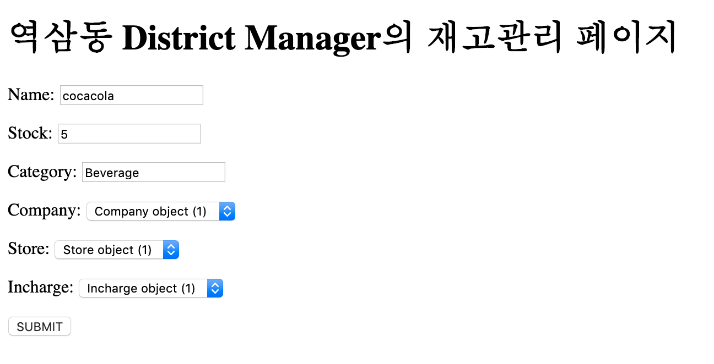

# ERD구현




재고관리 서비스를 제공하는 대상은 지역매니저(DM)입니다.

`Store`내의 지점들을 관리하며, 해당 지점들의 상품들을 `M:N`으로 관계를 지어서 보기 위해 중개테이블 `Incharge` 를 설정했습니다. 해당 테이블에서는 해당 지점의 해당 제품들을 관리하는 직원들의 정보가 담겨있습니다. 그리고 제조 회사와 각 제품별 `1:N`관계를 설정해 회사별 제품을 조회할 수 있게 데이터베이스를 설계했습니다.


## models.py

```
from django.db import models

# Create your models here.
class Store(models.Model):
    name = models.CharField(max_length=20)
    manager = models.CharField(max_length=20)

class Company(models.Model):
    name = models.CharField(max_length=20)

class Incharge(models.Model):
    SEX_SELECT = (
        ('M', 'Male'),
        ('F', 'Female'),
        )
    name = models.CharField(max_length=10)
    sex = models.CharField(max_length=1, choices=SEX_SELECT)
    age = models.IntegerField()
    goods = models.ManyToManyField(Store, through='Item')

class Item(models.Model):
    name = models.CharField(max_length=20)
    stock = models.IntegerField()
    category = models.CharField(max_length=20)
    company = models.ForeignKey(Company, on_delete=models.PROTECT)
    store = models.ForeignKey(Store, on_delete=models.CASCADE)
    incharge = models.ForeignKey(Incharge, on_delete=models.CASCADE)
```





