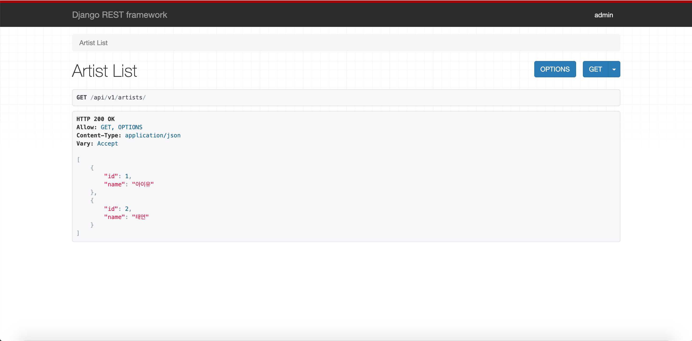
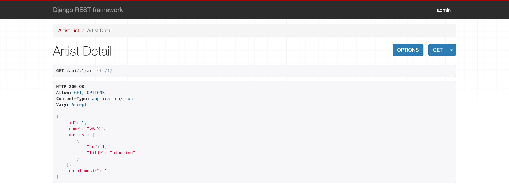
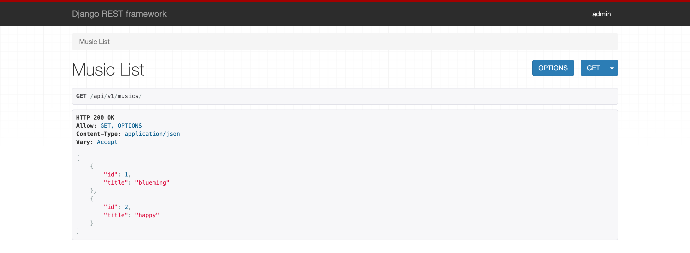
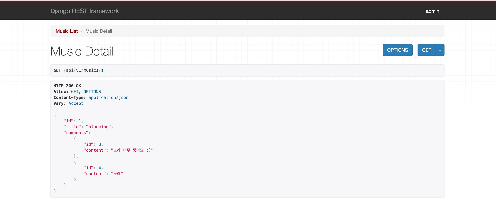
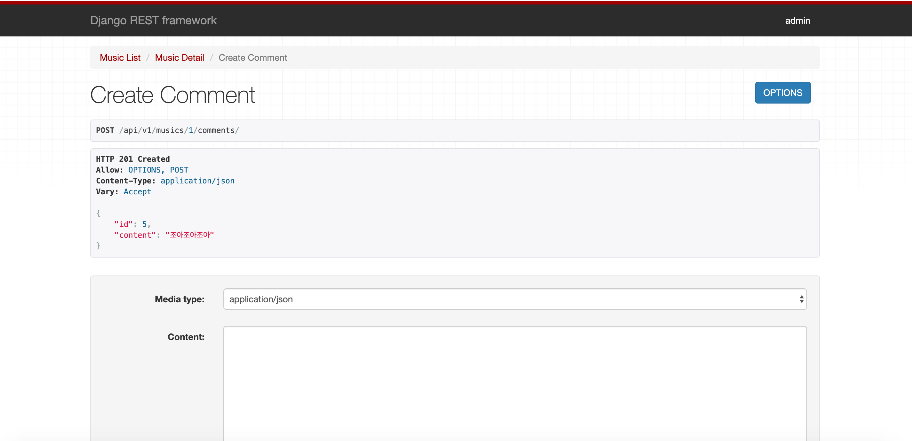
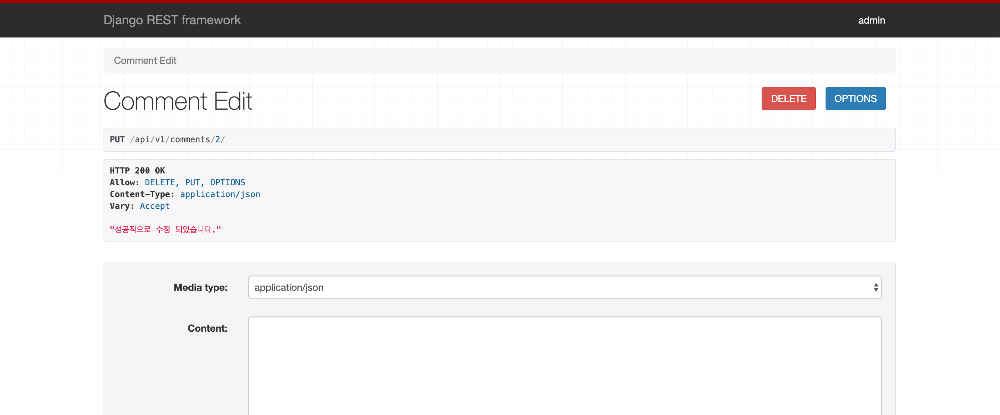
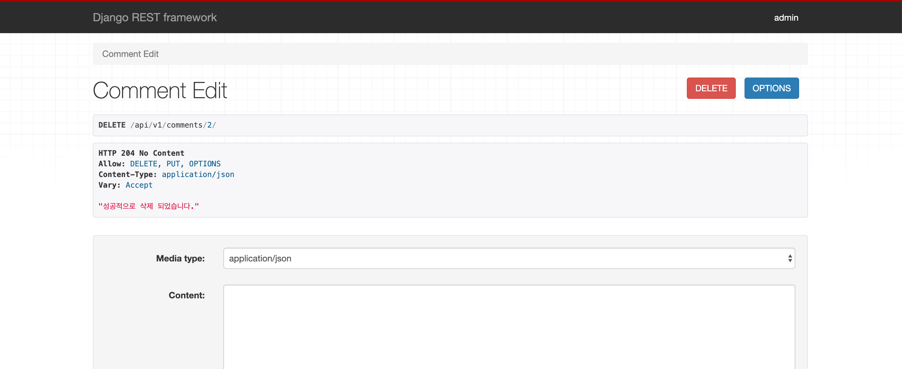

## views.py

```
from django.shortcuts import render, get_object_or_404
from rest_framework import status
from rest_framework.decorators import api_view
from rest_framework.response import Response
from .serializers import (
    ArtistSerializer,
    ArtistDetailSerializer,
    MusicSerializer,
    MusicDetailSerializer,
    CommentSerializer,
)
from .models import Artist, Music, Comment

#Create your views here.
@api_view(['GET'])
def artist_list(request):
    artists = Artist.objects.all()  # Queryset
    serializer = ArtistSerializer(artists, many=True) # Queryset => json으로 직렬화시키기
    return Response(serializer.data)

@api_view(['GET'])
def artist_detail(request, artist_pk):
    artist = get_object_or_404(Artist, pk=artist_pk)
    serializer = ArtistDetailSerializer(artist)
    return Response(serializer.data)

@api_view(['GET'])
def music_list(request):
    musics = Music.objects.all()
    serializer = MusicSerializer(musics, many=True)
    return Response(serializer.data)

@api_view(['GET'])
def music_detail(request, music_pk):
    music = get_object_or_404(Music, pk=music_pk)
    serializer = MusicDetailSerializer(music)
    return Response(serializer.data)

@api_view(['POST'])
def create_comment(request, music_pk):
    music = get_object_or_404(Music, pk=music_pk)
    # CommentForm(request.POST)
    serializer = CommentSerializer(data=request.data)
    if serializer.is_valid():
        # print('통과통과통과')
        serializer.save(music=music)
        return Response(serializer.data, status=status.HTTP_201_CREATED)
    return Response(status=status.HTTP_400_BAD_REQUEST)

@api_view(['PUT', 'DELETE'])
def comment_edit(request, comment_pk):
    comment = get_object_or_404(Comment, pk=comment_pk)
    if request.method == 'PUT':
        # CommentForm(instance, request.POST)
        serializer = CommentSerializer(comment, data=request.data)
        if serializer.is_valid():
            serializer.save()
            return Response('성공적으로 수정 되었습니다.')
        return Response(status=status.HTTP_400_BAD_REQUEST)
    if request.method == 'DELETE':
        comment.delete()
        return Response('성공적으로 삭제 되었습니다.', status=status.HTTP_204_NO_CONTENT)
```


## serializers.py

```
from rest_framework import serializers
from .models import Artist, Music, Comment


class ArtistSerializer(serializers.ModelSerializer):
    class Meta:
        model = Artist
        fields = ('id', 'name')

class MusicSerializer(serializers.ModelSerializer):
    class Meta:
        model = Music
        fields = ('id', 'title')

class ArtistDetailSerializer(serializers.ModelSerializer):
    # Artist:Music = 1:N
    # artist.music_set.all()
    musics = MusicSerializer(source='music_set', many=True)
    no_of_music = serializers.IntegerField(source='music_set.count')
    class Meta:
        model = Artist
        fields = ('id', 'name', 'musics', 'no_of_music')

class CommentSerializer(serializers.ModelSerializer):
    class Meta:
        model = Comment
        fields = ('id','content')

class MusicDetailSerializer(serializers.ModelSerializer):
    comments = CommentSerializer(source='comment_set', many=True)
    class Meta:
        model = Music
        fields = ('id', 'title', 'comments')
```


## GET api/v1/artists/




## GET api/v1/artists/<artist_pk>/




## GET api/v1/musics/



## GET api/v1/musics/<music_pk>/




## POST api/v1/musics/<music_pk>/comments/



## PUT & DELETE api/v1/comments/<comment_pk>/



