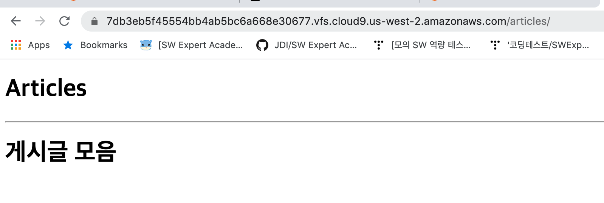
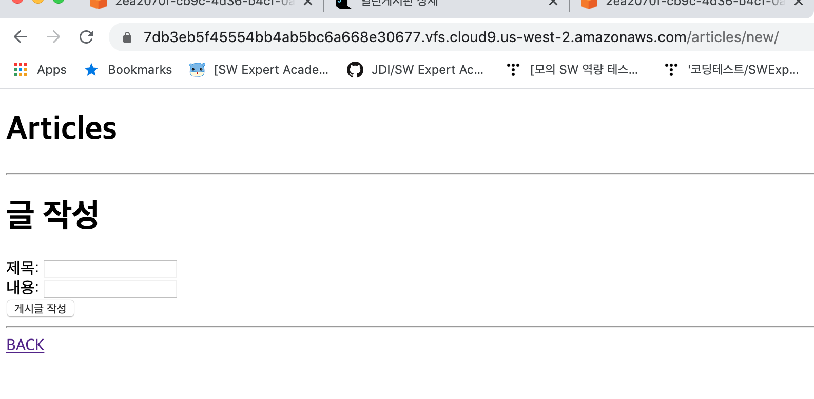

### 1. crud/settings.py

```
TEMPLATES = [
    {
        'BACKEND': 'django.template.backends.django.DjangoTemplates',
        'DIRS': [os.path.join(BASE_DIR, 'crud', 'templates')],
        'APP_DIRS': True,
        'OPTIONS': {
            'context_processors': [
                'django.template.context_processors.debug',
                'django.template.context_processors.request',
                'django.contrib.auth.context_processors.auth',
                'django.contrib.messages.context_processors.messages',
            ],
        },
    },
]
```


### 2. crud/urls.py

```
from django.contrib import admin
from django.urls import path, include
from articles import views

urlpatterns = [
    path('articles/new/', views.new),
    path('articles/', include('articles.urls')),
    path('admin/', admin.site.urls),
]
```


### 3. articles/urls.py

```
from django.urls import path
from . import views

urlpatterns = [
    #articles/
    path('', views.index), #articles/
    path('new/', views.new), #articles/new/
    path('create/', views.create),

    ]
```


### 4. articles/views.py

```
from django.shortcuts import render
from . models import Article

# Create your views here.
def index(request):
    articles = Article.objects.all()   # QuerySet => 인덱싱으로 접근 가능
    context = {
        'articles': articles,
    }

    return render(request, 'articles/index.html', context)

def new(request):
    return render(request, 'articles/new.html')

def create(request):
    title = request.GET.get('title')
    content = request.GET.get('content')
    article = Article()
    article.title = title
    article.content = content
    article.save()
    return render(request, 'articles.create.html')
```


### 5. crud/templates/base.html

```
<!DOCTYPE html>
<html lang="ko">
<head>
    <meta charset="UTF-8">
    <meta name="viewport" content="width=device-width, initial-scale=1.0">
    <meta http-equiv="X-UA-Compatible" content="ie=edge">
    <title>Document</title>
</head>
<body>
    <h1>Articles</h1>
    <hr>
    
    
</body>
</html>
```


### 6. templates/articles/index.html

```



    <h1>게시글 모음</h1>
    
    
      <h2>{{ article.title }}</h2>
    


```


### 7. Templates/articles/new.html

```



<h1>글 작성</h1>
<form action = 'articles/create/' method="GET">
    제목: <input type="text" name = "title"><br>
    내용: <input type="text" name "content"><br>
    <input type="submit" value="게시글 작성">
    <hr>
</form>
<a href="/articles/">BACK</a>

```


### 8. templates/articles/create.html

````



<h1>글이 성공적으로 작성되었습니다.</h1>
<a href="/articles/">BACK</a>

````


<hr>





