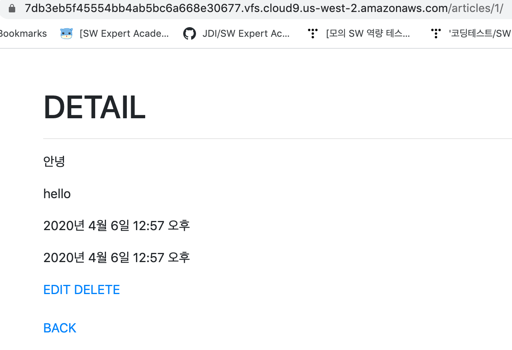
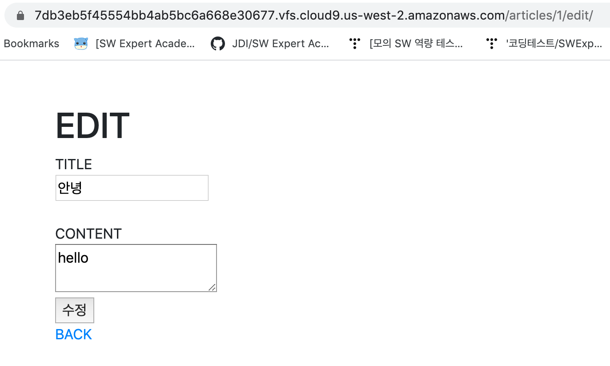

## models.py

```
from django.db import models

# Create your models here.
class Article(models.Model):
    title = models.CharField(max_length=20)
    content = models.TextField()
    create_at = models.DateTimeField(auto_now_add = True)
    updated_at = models.DateTimeField(auto_now = True)
```


## crud/urls.py

```
from django.contrib import admin
from django.urls import path,include
from articles import views

urlpatterns = [
    path('articles/', include('articles.urls')),
    path('admin/', admin.site.urls),
]
```


## articles/urls.py

```
from django.urls import path,include
from . import views

urlpatterns = [
    path('', views.index),
    path('new/', views.new),
    path('create/', views.create),
    path('<int:pk>/', views.detail),     #/articles/{{ article.pk }}/
    path('<int:pk>/delete/', views.delete),      #/articles/{{ article.pk }}/delete
    path('<int:pk>/edit/', views.edit),
    path('<int:pk>/update/', views.update),

]
```


## views.py

```
from django.shortcuts import render, redirect
from .models import Article

# Create your views here.
def index(request):
    article = Article.objects.all()
    context = {
        'articles' : article
    }
    return render(request,'articles/index.html' ,context)
    

def new(request):
    return render(request,'articles/new.html' )
    

def create(request):
    title = request.GET.get("title")
    content = request.GET.get("content")
    article = Article()
    article.title = title
    article.content = content
    article.save()
    return redirect('/articles/')


def detail(request, pk):
    article =Article.objects.get(pk=pk)
    context ={
        'article': article,
    }
    return render(request, 'articles/detail.html', context)
    

def delete(request,pk):
    article = Article.objects.get(pk=pk)
    article.delete()
    return redirect('/articles/')


def edit(request,pk):
    article = Article.objects.get(pk=pk)
    context = {
        'article':article,
    }
    return render(request, 'articles/edit.html', context)
    

def update(request, pk):
    title = request.GET.get('title')
    content = request.GET.get('content')
    article = Article.objects.get(pk=pk)
    article.title = title
    article.content = content
    article.save()
    return redirect(f'/articles/{pk}/')
```


## base.html

```
<!DOCTYPE html>
<html lang="en">
<head>
    <meta charset="UTF-8">
    <meta name="viewport" content="width=device-width, initial-scale=1.0">
    <meta http-equiv="X-UA-Compatible" content="ie=edge">
    <title>Document</title>
    <link rel="stylesheet" href="https://stackpath.bootstrapcdn.com/bootstrap/4.4.1/css/bootstrap.min.css" integrity="sha384-Vkoo8x4CGsO3+Hhxv8T/Q5PaXtkKtu6ug5TOeNV6gBiFeWPGFN9MuhOf23Q9Ifjh" crossorigin="anonymous">
</head>
<body>
    <div class="container my-5">
        
        
    </div>

    <script src="https://code.jquery.com/jquery-3.4.1.slim.min.js" integrity="sha384-J6qa4849blE2+poT4WnyKhv5vZF5SrPo0iEjwBvKU7imGFAV0wwj1yYfoRSJoZ+n" crossorigin="anonymous">			</script>
    <script src="https://cdn.jsdelivr.net/npm/popper.js@1.16.0/dist/umd/popper.min.js" integrity="sha384-Q6E9RHvbIyZFJoft+2mJbHaEWldlvI9IOYy5n3zV9zzTtmI3UksdQRVvoxMfooAo" crossorigin="anonymous"></script>
    <script src="https://stackpath.bootstrapcdn.com/bootstrap/4.4.1/js/bootstrap.min.js" integrity="sha384-wfSDF2E50Y2D1uUdj0O3uMBJnjuUD4Ih7YwaYd1iqfktj0Uod8GCExl3Og8ifwB6" crossorigin="anonymous"></script>
</body>
</html>
```


## READ

- index.html

```



<h1>INDEX</h1>
<a href="/articles/new/">NEW</a>
    <br>
    
    <br>
    <h2>{{ article.title }}</h2>
    <p>{{ article.content }}</p>
    <a href = "/articles/{{ article.pk }}/">DETAIL</a>
    <hr>
    

```


## CREATE

- new.html

```



<h1>NEW</h1>
    <form action="/articles/create/" method="GET">
        TITLE<br>
        <input type="text" name="title"><br>
        <br>
        CONTENT<br>
        <textarea name="content"></textarea><br>
        <input type="submit" value="작성">
    </form>
<a href="/articles/">BACK</a>

```


## DETAIL

- detail.html

```



<h1>DETAIL</h1>
<hr>
    <p>{{ article.title }}</p>
    <p>{{ article.content }}</p>
    <p>{{ article.create_at }}</p>
    <p>{{ article.updated_at }}</p>

    <a href="/articles/{{ article.pk }}/edit/">EDIT</a>
    <a href="/articles/{{ article.pk }}/delete/">DELETE</a><br>
    <br>
    <a href="/articles">BACK</a>

```





## UPDATE

- edit.html

```



<h1>EDIT</h1>
    <form action="/articles/{{ article.pk }}/update/" method="GET">
        TITLE<br>
        <input type="text" name="title" value="{{ article.title }}"><br>
        <br>
        CONTENT<br>
        <textarea name="content">{{ article.content }}</textarea><br>
        <input type="submit" value="수정">
    </form>
<a href="/articles/">BACK</a>

```


